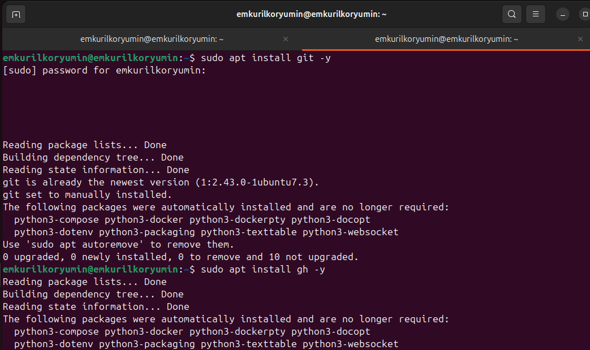
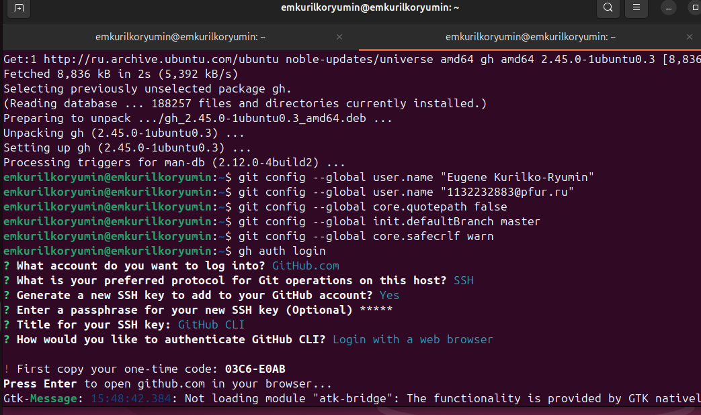
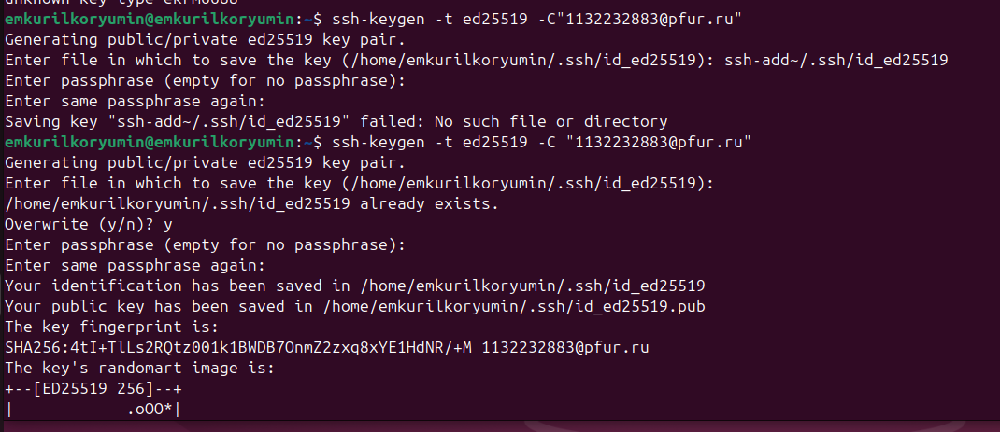
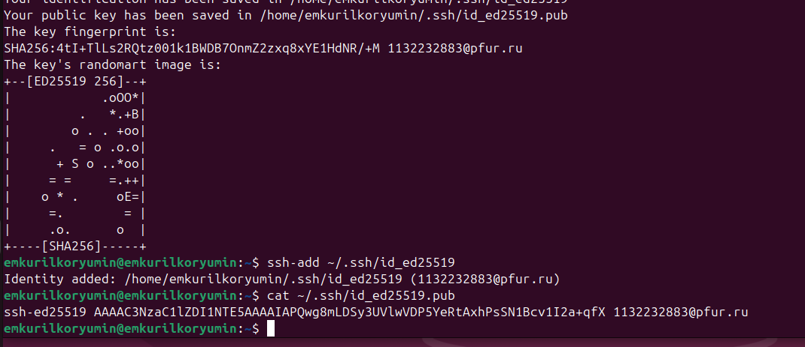
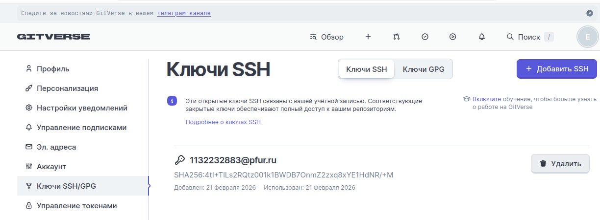
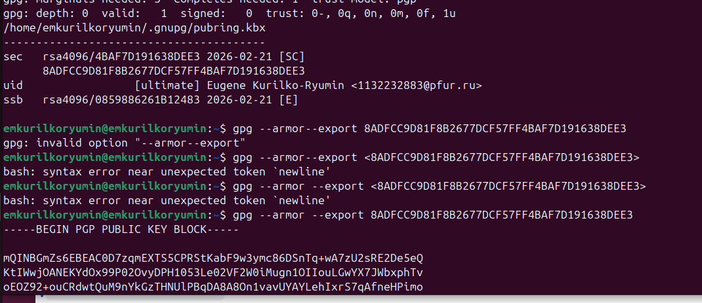
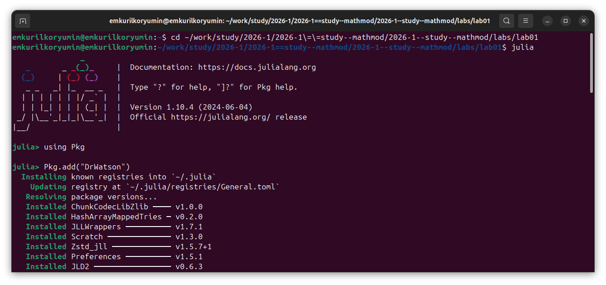
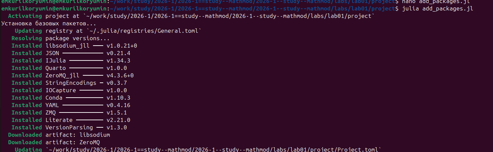

---
## Author
author:
  name: Курилко-Рюмин Евгений Михайлович 
  degrees: DSc
  orcid: 0000-0002-0877-7063
  email: 1132232883@rudn.ru
  affiliation:
    - name: Российский университет дружбы народов
      country: Российская Федерация
      postal-code: 117198
      city: Москва
      address: 

## Title
title: "Математическое моделирование"
subtitle: "Лабораторная работа №1"
license: "CC BY"
---

# Цель работы

Исследовать решение обыкновенного дифференциального уравнения экспоненциального роста с использованием языка программирования Julia и инструментов воспроизводимых исследований (DrWatson, Literate, Quarto), а также освоить методы параметрического анализа, визуализации и документирования результатов вычислительного эксперимента.

# Задание

1. Настройка git и gh
2. Создание проекта DrWatson для лабораторных
3. Создание производных форматов

# Теоретическое введение

Модель экспоненциального роста описывает процесс изменения величины, скорость которого пропорциональна текущему значению. Данная модель является классическим объектом исследования в различных областях: биологии, физике, экономике и демографии. Ключевой характеристикой процесса является время удвоения — период, за который исследуемая величина увеличивается вдвое.

Численное решение дифференциального уравнения экспоненциального роста позволяет исследовать поведение системы при различных параметрах, проводить параметрический анализ и верифицировать численные методы. Сравнение численного решения с аналитической зависимостью дает возможность оценить точность выбранных алгоритмов и методов интегрирования.

# Выполнение лабораторной работы

## 1. Настройка git и gh

Проведена установка git.

Выполнена базовая настройка git.

Проведена настройка gh.

Создан ключ SSH.

Ключ добавлен в учетную запись gitverse через web-интерфейс.

Аналогичная операция была выполнена для github.

Сгенерирован ключ PGP.

Далее создано пространство лабораторной работы аналогично предыдущим годам обучения.

## 2. Создание проекта DrWatson для лабораторных

Создание проекта выполнено вариантом А. Для начала запущена Julia и выполнены команды в REPL.

Выполнена команда `using DrWatson`.

В корне проекта файла `add_packages` изменен код.

Проверена успешность установки всех пакетов.

Запущен скрипт `scripts/01_exponential_growth.jl`. Результирующий график сохранен в каталоге `plots/`.

# Выводы

В ходе выполнения лабораторной работы реализована численная модель экспоненциального роста с использованием языка программирования Julia и пакетов DifferentialEquations.jl, DrWatson.jl, Plots.jl. Проведен базовый вычислительный эксперимент при фиксированном значении скорости роста, а также параметрическое сканирование с анализом зависимости поведения системы от коэффициента α.
