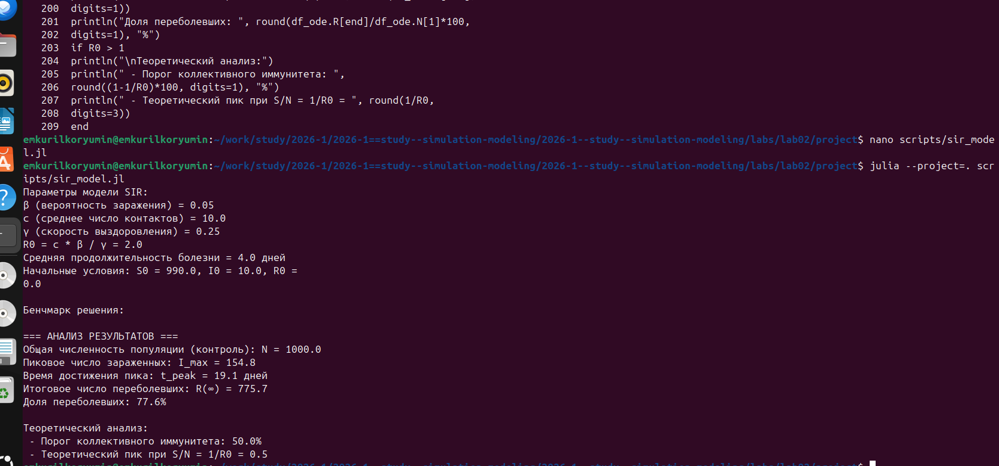
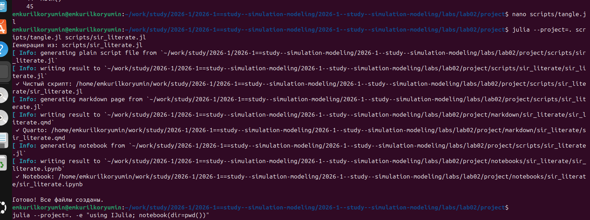

---
## Author
author:
  name:  Курилко-Рюмин Евгений Михайлович 
  degrees: DSc
  orcid: 0000-0002-0877-7063
  email: 1132232883@rudn.ru
  affiliation:
    - name: Российский университет дружбы народов
      country: Российская Федерация
      postal-code: 117198
      city: Москва
      address: ул. Миклухо-Маклая, д. 6

## Language settings
lang: ru-RU
babel-lang: russian
polyglossia-lang:
  name: russian
  options:
    - spelling=modern
    - babelshorthands=true

## Title
title:  Презентации по Лабораторной работе 2 
subtitle: Предмету Имитационное Моделирование 
license: CC BY
date: today
date-format: "2026-03-06" # Example: 2025-09-06
---

# Информация

## Докладчик

:::::::::::::: {.columns align=center}
::: {.column width="70%"}

  * Курилко-Рюмин Евгений Михайлович 
  * студент РУДН
  * Российский университет дружбы народов им. П. Лумумбы
  * [1132232883@rudn.ru](mailto:1132232883@rudn.ru)
  * <https://emkurilkoryumin.github.io/ru/>

:::
::: {.column width="30%"}

:::
::::::::::::::

# Вводная часть

## Цели и задачи

Иследование математической модели SIR и Лотки–Вольтерры через решение систем дифференциальных уравнений.

Провести анализ полученных результатов при помощи языка Julia

1.Изучить модель SIR

2.Изучить модель Лотки–Вольтерры

3.Создать производные форматы

4.Провести иследование моделей

# Выполнение лабораторной работы

## Модель SIR

## Модель Лотки–Вольтерры
 

## Создание производных форматов 

 

# Результаты

