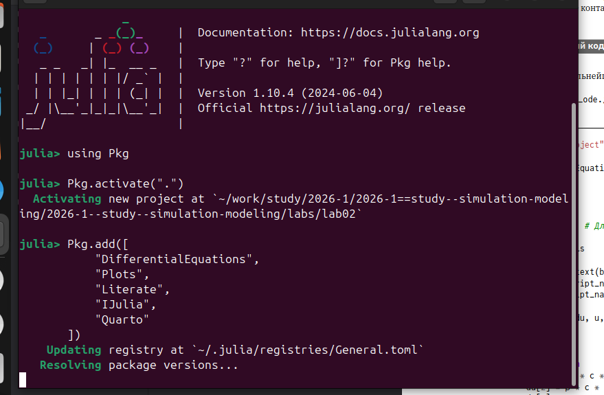
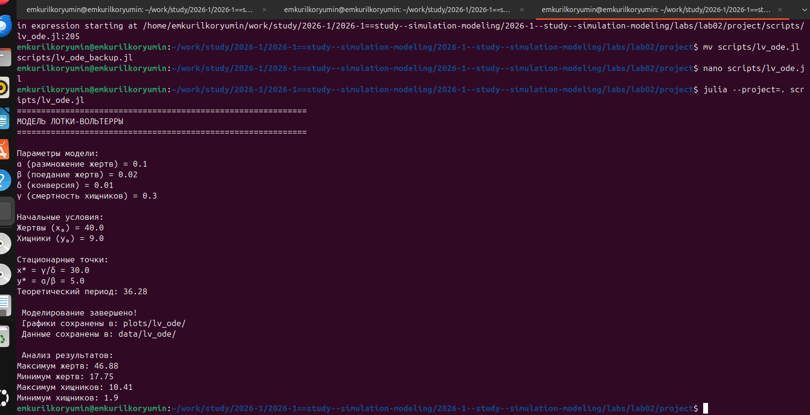
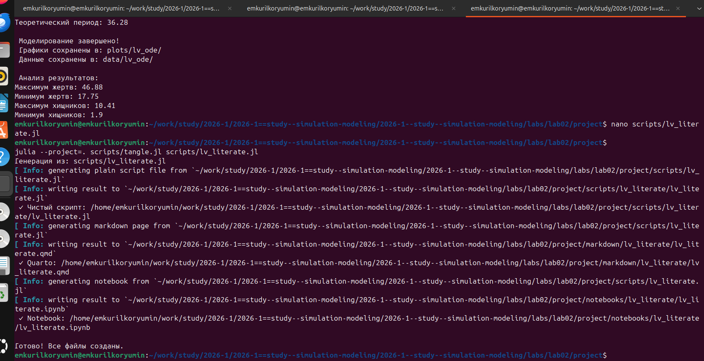
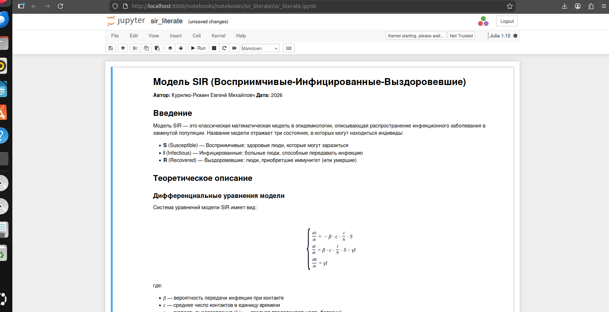

---
## Author
author:
  name: Курилко-Рюмин Евгений Михайлович
  degrees: DSc
  orcid: 0000-0002-0877-7063
  email: 1132232883@rudn.ru
  affiliation:
    - name: Российский университет дружбы народов
      country: Российская Федерация
      postal-code: 117198
      city: Москва
      address: ул. Миклухо-Маклая, д. 6

## Title
title: "Отчёта по лабораторной работе 2"
subtitle: "По предмету Имитационное Моделирование"
license: "CC BY"
---

# Цель работы

Иследование математической модели SIR и Лотки–Вольтерры через решение систем дифференциальных уравнений.

Провести анализ полученных результатов при помощи языка Julia

# Задание

1.Изучить модель SIR

2.Изучить модель Лотки–Вольтерры

3.Создать производные форматы

4.Провести иследование моделей

# Теоретическое введение

Модель SIR — инструмент эпидемиологического моделирования, разделяющий популяцию на три группы: восприимчивые (S), инфицированные (I) и переболевшие (R). Основные допущения: замкнутость популяции, случайное перемешивание индивидов, отсутствие инкубационного периода и пожизненный иммунитет. Параметр R0 (базовое репродуктивное число) показывает среднее количество вторичных заражений от одного больного. При R0 > 1 эпидемия развивается, при R0 < 1 затухает. Эффективное репродуктивное число Re снижается по мере уменьшения доли восприимчивых и достигает единицы в пике эпидемии.

Модель Лотки–Вольтерры описывает динамику системы «хищник-жертва». Численность жертв растёт пропорционально их количеству и убывает из-за выедания хищниками. Популяция хищников увеличивается благодаря потреблению жертв и сокращается за счёт естественной смертности. Система демонстрирует циклические колебания со сдвигом фаз между видами, а на фазовой плоскости формируются замкнутые траектории вокруг стационарной точки.

Эти модели стали классическими в своих областях: SIR используется для прогнозирования эпидемий и оценки мер борьбы с инфекциями, а модель Лотки–Вольтерры объясняет механизмы экологических циклов. Ограниченность исходных версий привела к созданию множества модификаций, учитывающих дополнительные факторы.

# Выполнение лабораторной работы

## Модель SIR

Устанавливаем пакеты в среде Julia для численного решения дифференциальных уравнений и работы с табличными данными для визуализации и спектрального анализа
Также был установлена библеотека Literate для генерации проиводных форматов отчета

Далее использовали заранее созданый скрипт реализирующий модель SIR с разделением заразности на вероятность передачи инфекции и частоту контактов 
При выполнении скрипта проведено решение системы уравнений и рассчитано базовое репродуктивное число.Получены массивы данных по динамике всех групп населения.

## Модель Лотки–Вольтерры

Скрипт для модели хищник-жертва,описывающий колебания числености двух видов, был также запущен как и скрипт SIR.
 

## Создание производных форматов 

С использованием пакета Literate.jl из исходных скриптов были сгенерированы:Чистый код (без комментариев),Jupyter notebooks для интерактивной работы Quarto документы для интеграции в отчет

 
Затем ноутбуки были открыты и выполнены в Jupyter для обеих моделей.В каждом из которых были выполнены ячейки с кодом,чтобы убедится в работоспособности моделей

# Выводы

В ходе выполнения лабораторной работы были реализованы две фундаментальные модели: эпидемиологическая модель SIR и экологическая модель Лотки-Вольтерры (хищник-жертва).

