---
## Author
author:
  name: Курилко-Рюмин Евгений Михайлович
  degrees: DSc
  orcid: 0000-0002-0877-7063
  email: 1132232883@rudn.ru
  affiliation:
    - name: Российский университет дружбы народов
      country: Российская Федерация
      postal-code: 117198
      city: Москва
      address: ул. Миклухо-Маклая, д. 6

## Title
title: "Отчёт по лабораторной работе №4"
subtitle: "Реализация модели болезни в агентном подходе"
license: "CC BY"
---

# Цель работы

Цель работы --- реализовать модель болезни `SIR` в агентном подходе с
использованием `Agents.jl`, выполнить основной и дополнительный сценарии,
сгенерировать из literate-кода чистые скрипты, `Jupyter notebook` и
`Quarto`-документацию, а затем включить результаты в отчёт.

# Задание

- создать рабочий каталог для лабораторной работы;
- установить необходимые пакеты Julia;
- реализовать агентную модель болезни `SIR`;
- выполнить базовый сценарий моделирования;
- преобразовать код в литературный стиль;
- сгенерировать из literate-кода чистый `.jl`, `ipynb` и `qmd`;
- выполнить сгенерированные notebook;
- добавить дополнительный сценарий с набором параметров;
- включить результаты в отчёт.

# Теоретическое введение

Модель `SIR` делит популяцию на три группы:

- `S` --- восприимчивые;
- `I` --- инфицированные;
- `R` --- выздоровевшие.

В агентной постановке каждый человек представляется отдельным агентом. На
каждом шаге моделирования заражённый агент может передать инфекцию другим
агентам, а затем либо продолжить болеть, либо перейти в состояние
выздоровления. Такой подход позволяет изучать распространение болезни как
результат множества локальных взаимодействий между агентами.

В дискретной реализации ключевую роль играют три параметра:

- вероятность передачи инфекции `beta`;
- число контактов одного агента за шаг `contacts_per_day`;
- вероятность выздоровления `gamma`.

Для базовой оценки скорости распространения инфекции используется
репродуктивное число

$$
R_0 \approx \frac{\text{contacts\_per\_day} \cdot \beta}{\gamma}.
$$

Если в популяции уменьшается число восприимчивых, то эффективное
репродуктивное число падает по закону

$$
R_e(t) = R_0 \frac{S(t)}{N}.
$$

Как только `R_e(t) < 1`, эпидемическая волна начинает затухать: каждый
инфицированный в среднем заражает менее одного нового агента. Именно поэтому
на графиках SIR-модели максимум функции `I(t)` обычно достигается раньше, чем
исчерпывается запас восприимчивых агентов.

В программной реализации заражения и выздоровления сначала накапливаются во
временных списках, а затем применяются на шаге модели. Такое синхронное
обновление позволяет избежать зависимости результата от порядка обхода агентов
внутри одного такта.

В дополнительной части работы используется расширенная многогородная
SIR-модель. Агенты размещаются в нескольких городах и могут мигрировать между
ними согласно матрице вероятностей `migration_rates`. До обнаружения болезни
действует интенсивность передачи `β_und`, после обнаружения --- более низкая
интенсивность `β_det`. После завершения периода болезни агент либо
выздоравливает, либо выбывает из популяции как умерший, а для переболевших
допускается повторное заражение с вероятностью
`reinfection_probability`. Такое расширение позволяет исследовать влияние
миграции, неоднородности городов и управляющих мер на форму эпидемической
кривой.

# Выполнение лабораторной работы

## Подготовка проекта

Для лабораторной работы использован каталог `labs/lab04/project` со структурой
`DrWatson`. В проекте оставлены только файлы, относящиеся к модели болезни:

- исходник модели `src/sir_agents_model.jl`;
- базовый literate-скрипт `scripts/01_sir_agents.jl`;
- параметрический literate-скрипт `scripts/02_sir_agents_param.jl`;
- генератор производных форматов `scripts/generate_all.jl`.

На [рис. @fig-lab04-julia-start] показан запуск `Julia` в каталоге проекта.

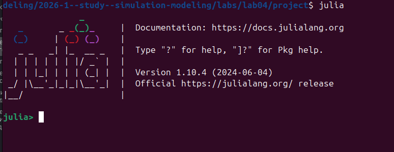{#fig-lab04-julia-start width=70%}

На [рис. @fig-lab04-pkg-mode] показан переход к настройке зависимостей через
`Pkg`.

{#fig-lab04-pkg-mode width=70%}

На [рис. @fig-lab04-activate] показана активация окружения проекта
`labs/lab04/project`.

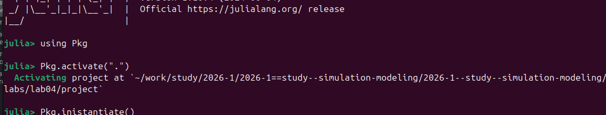{#fig-lab04-activate width=70%}

На [рис. @fig-lab04-deps] показана установка и проверка основных зависимостей
проекта.

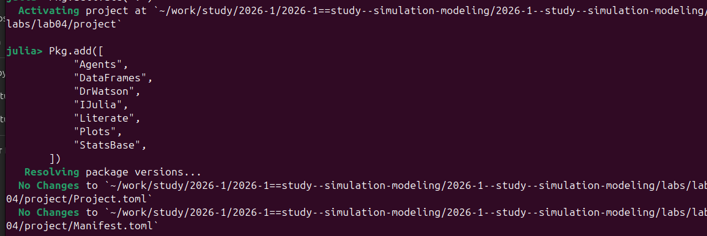{#fig-lab04-deps width=75%}

На [рис. @fig-lab04-edit] показано редактирование исходных файлов и
исследовательских скриптов проекта.

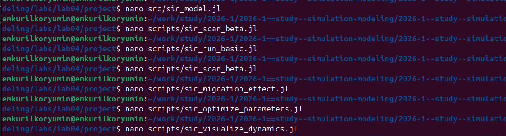{#fig-lab04-edit width=90%}

## Базовый сценарий SIR

В базовом эксперименте использованы параметры:

- размер популяции `1000`;
- начально инфицированных `10`;
- вероятность заражения `beta = 0.05`;
- число контактов `10`;
- скорость выздоровления `gamma = 0.25`.

Получено базовое репродуктивное число `R0 = 2.0`. По результатам моделирования
пик заражения составил `168` человек на `18`-м шаге, а число переболевших к
концу моделирования достигло `789`.

На [рис. @fig-lab04-run-basic] показан запуск базового сценария
`01_sir_agents.jl` и краткая сводка его результатов.

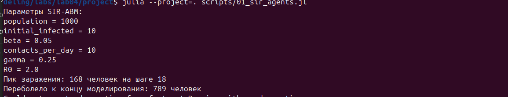{#fig-lab04-run-basic width=80%}

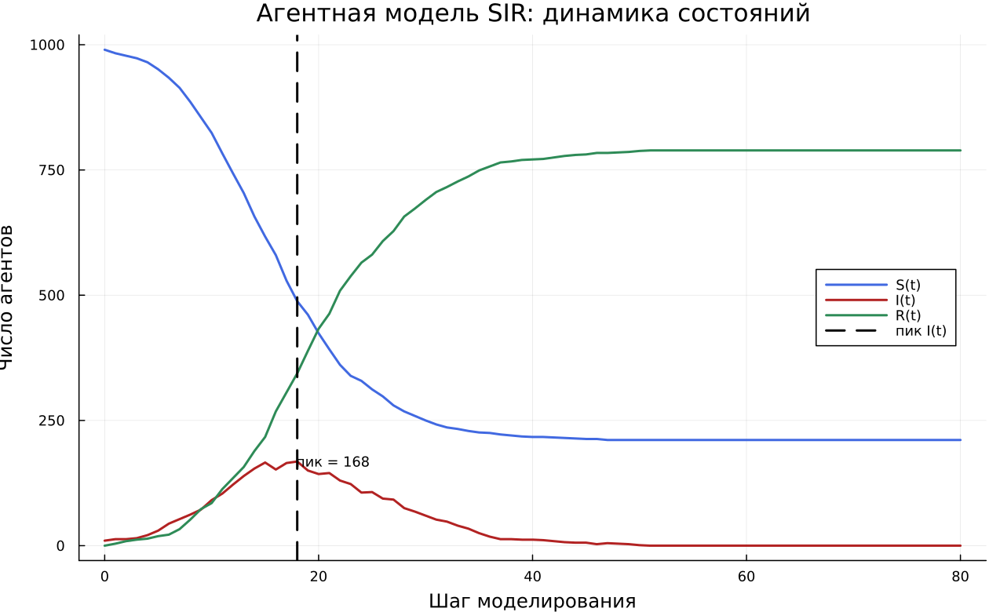{#fig-sir-main width=90%}

На [рис. @fig-sir-infected] выделена отдельная кривая `I(t)`, по которой
удобно определять момент пика эпидемии и длительность активной фазы вспышки.

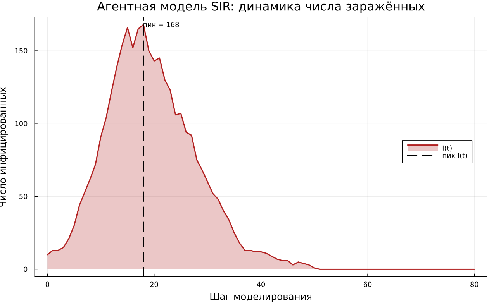{#fig-sir-infected width=85%}

На [рис. @fig-sir-shares] показано изменение долей популяции, а на
[рис. @fig-sir-re] --- динамика эффективного репродуктивного числа.

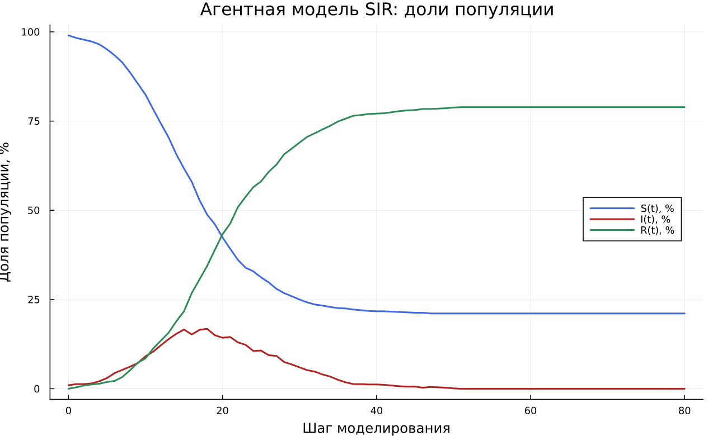{#fig-sir-shares width=90%}

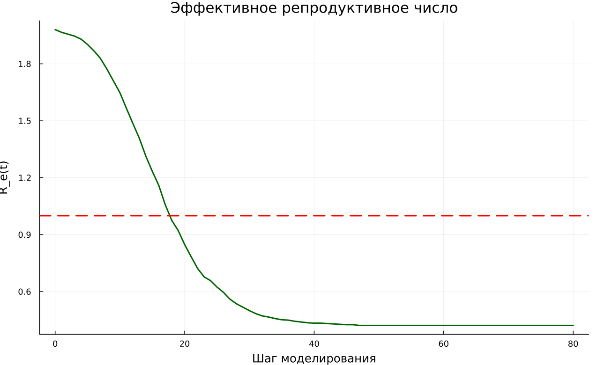{#fig-sir-re width=80%}

На [рис. @fig-sir-log] число инфицированных представлено в логарифмическом
масштабе. Такой способ визуализации делает лучше заметной раннюю фазу роста,
когда абсолютное число заражённых ещё мало, но тенденция к экспоненциальному
увеличению уже выражена.

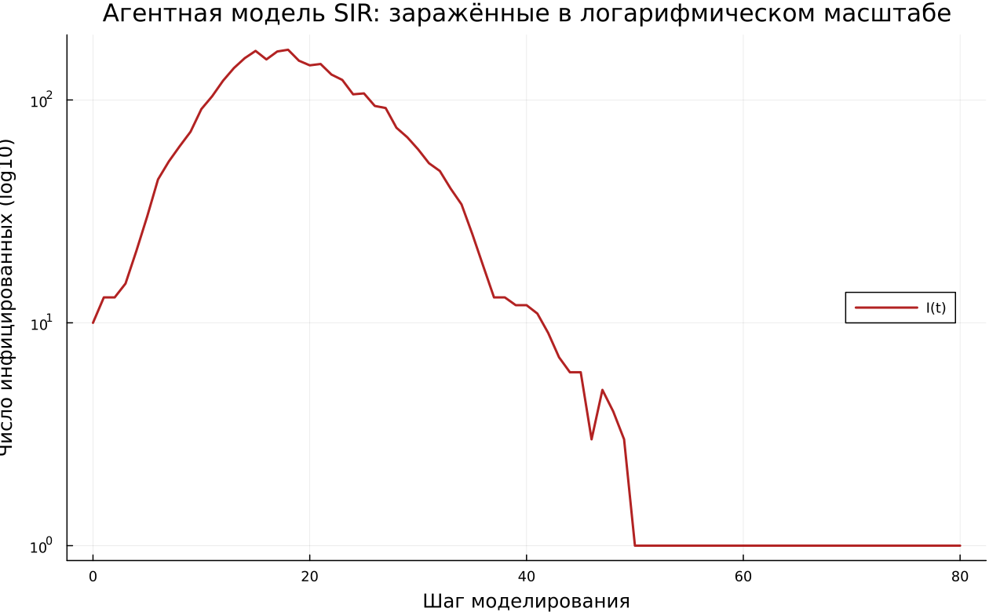{#fig-sir-log width=85%}

Фазовый портрет модели представлен на [рис. @fig-sir-phase].

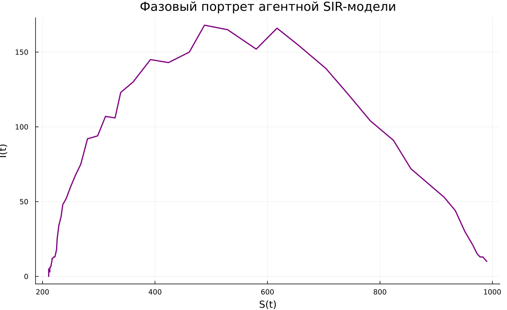{#fig-sir-phase width=80%}

На [рис. @fig-sir-panel] собрана компактная панель основных диагностик модели:
динамика `S(t)`, `I(t)`, `R(t)`, логарифмическая кривая заражений, фазовый
портрет и эффективное репродуктивное число.

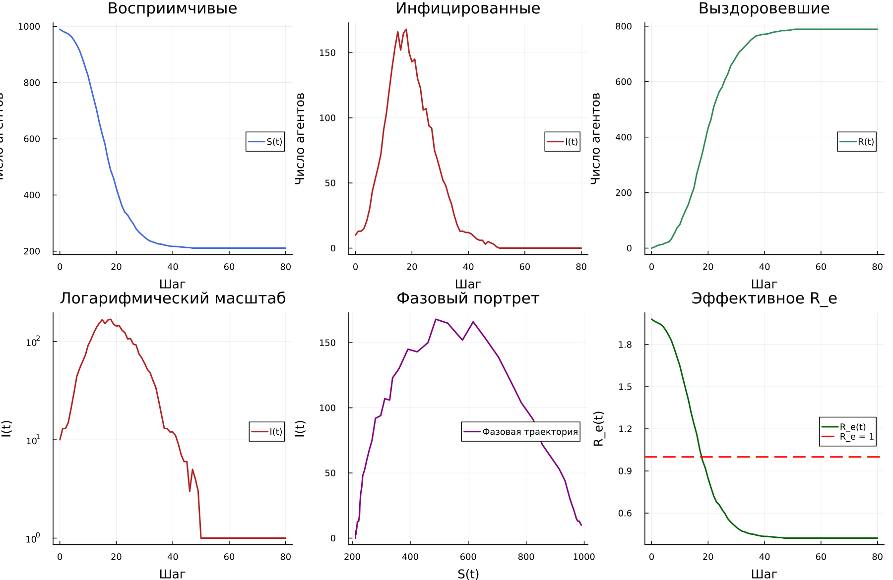{#fig-sir-panel width=95%}

## Дополнительное задание: набор параметров

Для дополнительного исследования были рассмотрены четыре сценария:

- базовый;
- уменьшение числа контактов;
- увеличение числа контактов;
- ускоренное выздоровление.

| Сценарий | `beta` | Контакты | `gamma` | `R0` | Шаг пика | Пик инфицированных | Переболело |
|---|---:|---:|---:|---:|---:|---:|---:|
| `base` | 0.05 | 10 | 0.25 | 2.00 | 22 | 156 | 777 |
| `low_contacts` | 0.05 | 6 | 0.25 | 1.20 | 33 | 43 | 325 |
| `high_contacts` | 0.05 | 14 | 0.25 | 2.80 | 14 | 290 | 920 |
| `fast_recovery` | 0.05 | 10 | 0.35 | 1.43 | 32 | 46 | 493 |

: Сводка параметрического исследования SIR {#tbl-sir-param}

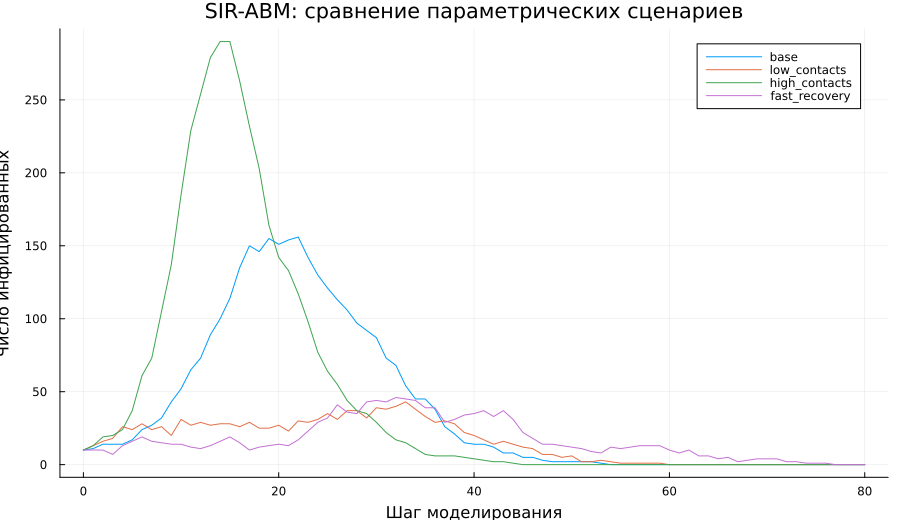{#fig-sir-param width=90%}

Параметрическое исследование показывает, что уменьшение числа контактов
снижает пик эпидемии и итоговое число заболевших, а рост числа контактов
существенно увеличивает пик и ускоряет его наступление.

## Выполнение дополнительного задания

Для дополнительного исследования использована расширенная многогородная
SIR-модель из `sir_extra_model.jl`. В ней эпидемия развивается сразу в
нескольких городах, а интенсивность передачи инфекции, миграция, смертность и
вероятность повторного заражения задаются явно. Это позволяет рассматривать
не только одну эпидемическую волну, но и влияние мобильности и управляющих
мер на итоговую динамику.

### Базовый запуск расширенной модели

На [рис. @fig-lab04-extra-basic] показано завершение параметрического запуска и
переход к скрипту `extra_sir_run_basic.jl`.

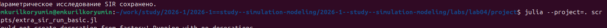{#fig-lab04-extra-basic width=100%}

В базовом дополнительном сценарии рассматривались три города по `600` агентов
в каждом, интенсивность скрытой передачи `β_und = 0.5`, интенсивность после
обнаружения `β_det = 0.05`, длительность болезни `14` шагов и смертность
`0.02`. Начальное заражение помещалось в третий город.

На [рис. @fig-extra-basic-plot] показана суммарная динамика расширенной
модели. Пик инфекции достигается уже на `11`-м шаге, при этом в пике заражение
охватывает практически всю популяцию (`peak_share = 1.0`). К концу прогона
доля переболевших достигает `0.9083`, а доля умерших --- `0.0244`.

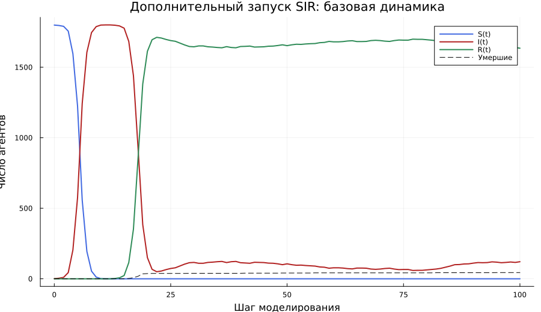{#fig-extra-basic-plot width=90%}

### Сканирование параметра beta

На [рис. @fig-lab04-extra-beta] показан переход к исследованию влияния
параметра `beta` с помощью скрипта `extra_sir_scan_beta.jl`.

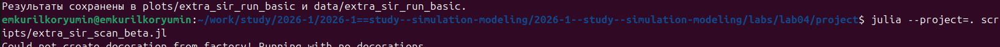{#fig-lab04-extra-beta width=100%}

В этом эксперименте параметр `beta` изменялся от `0.1` до `0.8`, а итоговые
характеристики усреднялись по нескольким значениям `seed`. На
[рис. @fig-extra-beta-scan] видно, что уже при `beta = 0.2` средняя доля
заражённых в пике превышает `0.91`, а при `beta >= 0.6` эпидемия не только
почти полностью охватывает популяцию в максимуме, но и оставляет заметную
конечную долю инфицированных и более высокую смертность.

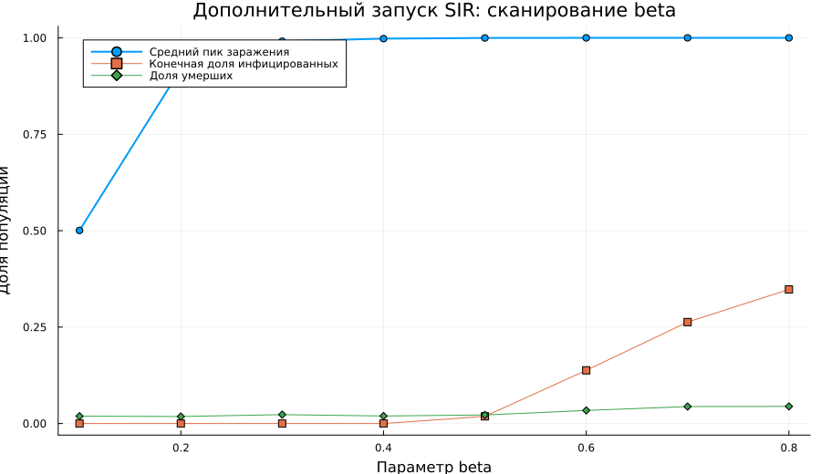{#fig-extra-beta-scan width=90%}

Для оценки границы между затухающим и развивающимся сценарием был дополнительно
выполнен поиск эпидемического порога. На [рис. @fig-extra-threshold] видно,
что наблюдаемый порог наступает при `beta ≈ 0.07`, что хорошо согласуется с
теоретической оценкой `beta = gamma = 1/14 ≈ 0.0714` для условия `R0 = 1`.
Соответствующее наблюдаемое значение `R0` составило примерно `0.98`.

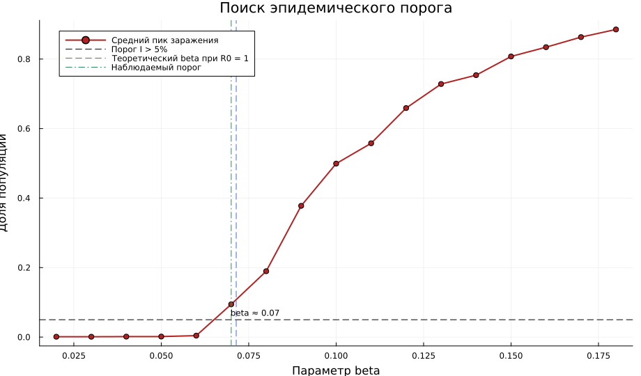{#fig-extra-threshold width=90%}

### Влияние миграции между городами

На [рис. @fig-lab04-extra-migration] показан запуск сценария с миграцией
`extra_sir_migration_effect.jl`.

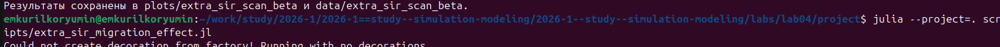{#fig-lab04-extra-migration width=100%}

На [рис. @fig-extra-migration-plot] приведены зависимости времени до пика и
доли заражённых в пике от интенсивности миграции. При нулевой миграции средняя
доля инфицированных в пике составляет около `0.3331`, тогда как при ненулевых
интенсивностях она практически достигает `1.0`. Это показывает, что перенос
инфекции между городами резко усиливает синхронизацию вспышек и делает общую
эпидемическую волну намного более тяжёлой.

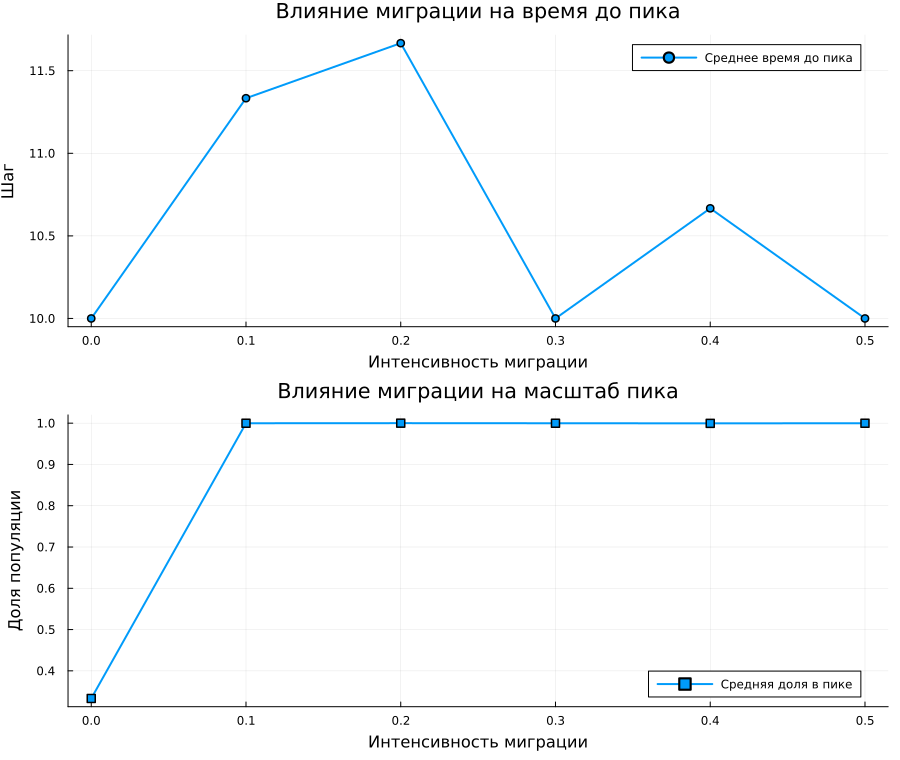{#fig-extra-migration-plot width=90%}

### Подбор параметров и пространство решений

На [рис. @fig-lab04-extra-opt-start] показан переход к оптимизации параметров
в скрипте `extra_sir_optimize_parameters.jl`.

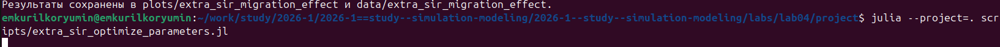{#fig-lab04-extra-opt-start width=100%}

На [рис. @fig-lab04-extra-opt-result] приведён фрагмент итоговых параметров,
полученных в ходе оптимизационного запуска.

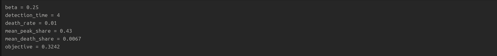{#fig-lab04-extra-opt-result width=90%}

В оптимизационном эксперименте перебирались значения `beta`, времени
обнаружения и смертности при ограничении `mean_peak_share < 0.30`. Лучшим
допустимым набором оказался `beta = 0.03`, `detection_time = 2`,
`death_rate = 0.005`: при этих параметрах средняя доля заражённых в пике
составила `0.0011`, а средняя доля умерших оказалась равной нулю.

На [рис. @fig-extra-opt-plot] показано пространство решений. Видно, что
уменьшение `beta` и ускорение выявления инфекции сдвигают решения в область
одновременно малого пика и низкой смертности.

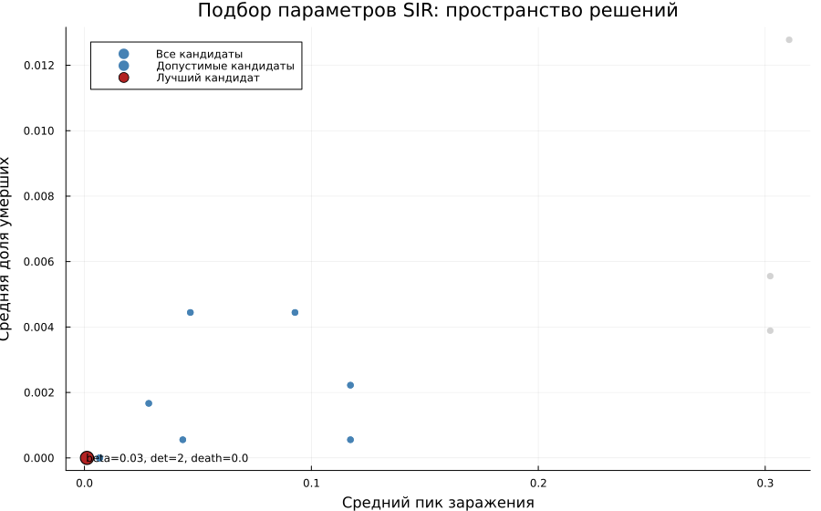{#fig-extra-opt-plot width=90%}

### Карантинный сценарий

На [рис. @fig-extra-quarantine] показано сравнение базового сценария и
сценария с карантином, который включался при превышении доли инфицированных в
городе порога `0.08`.

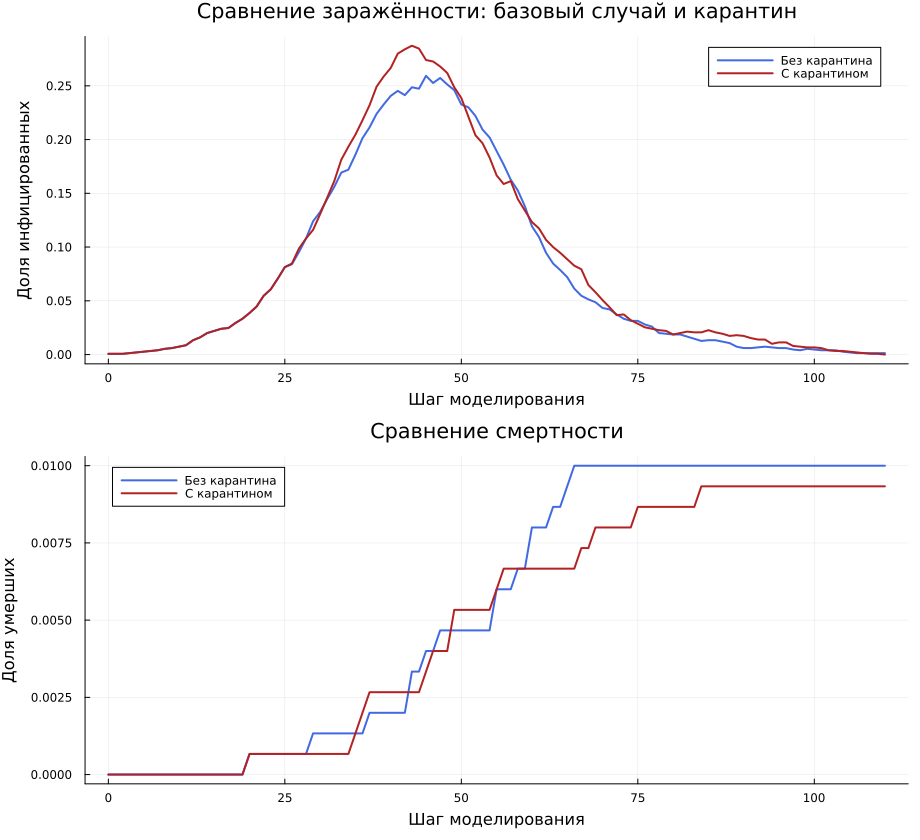{#fig-extra-quarantine width=90%}

В рассматриваемой конфигурации карантин немного уменьшил итоговую долю умерших
(`0.0093` против `0.0100`), но не снизил высоту эпидемического пика:
максимальная доля инфицированных даже выросла с `0.2593` до `0.2873`, а пик
наступил раньше. Это показывает, что выбранный порог срабатывания и момент
закрытия города важны не меньше самого факта введения ограничений.

### Неоднородность городов

В сценарии с неоднородными городами сравнивались два случая: однородный
`beta = 0.08` во всех городах и неоднородный набор
`beta = [0.12, 0.08, 0.04]`. На [рис. @fig-extra-heterogeneity-overall]
показано, что неоднородность почти не меняет высоту суммарного пика
(`0.2387` против `0.2413`), но делает эпидемическую волну более ранней
(`51` шаг против `59`) и уменьшает итоговую смертность.

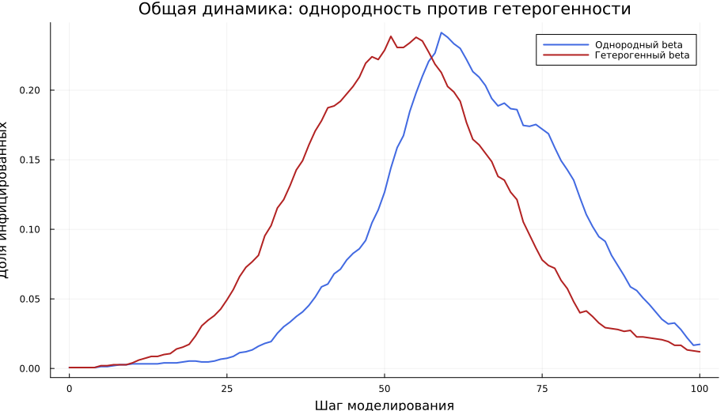{#fig-extra-heterogeneity-overall width=90%}

На [рис. @fig-extra-heterogeneity-cities] приведены траектории `S(t)`, `I(t)` и
`R(t)` по отдельным городам. Видно, что увеличение `beta` в одном городе
ускоряет локальную вспышку и изменяет форму суммарной кривой даже при близком
значении общего пика.

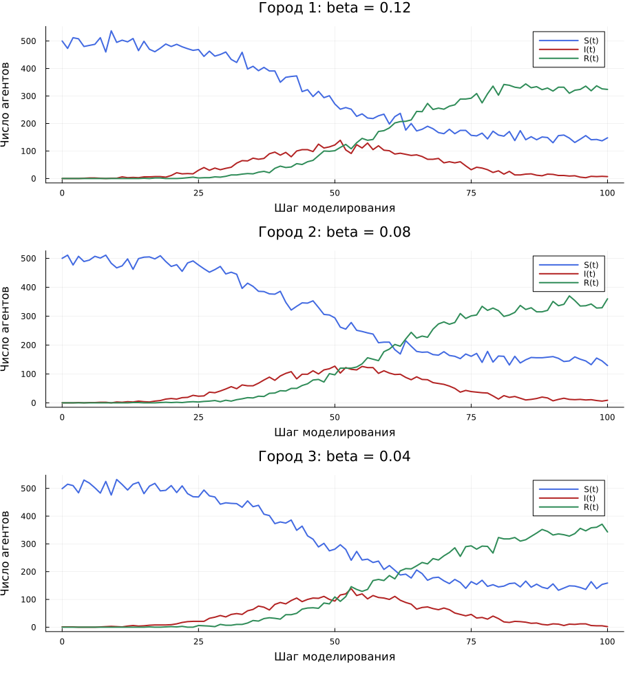{#fig-extra-heterogeneity-cities width=90%}

### Сводная визуализация результатов

На [рис. @fig-lab04-extra-visual] показан переход к сводной визуализации
динамики в скрипте `extra_sir_visualize_dynamics.jl`.

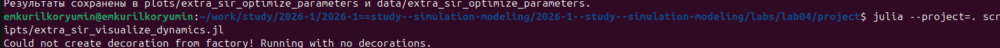{#fig-lab04-extra-visual width=100%}

На [рис. @fig-extra-comprehensive] приведена итоговая трёхпанельная
визуализация результатов сканирования `beta`: отдельно показаны рост
максимальной доли заражённых, конечной доли инфицированных и смертности. Такая
форма представления удобна для сопоставления нескольких критериев качества
эпидемической динамики в одном исследовании.

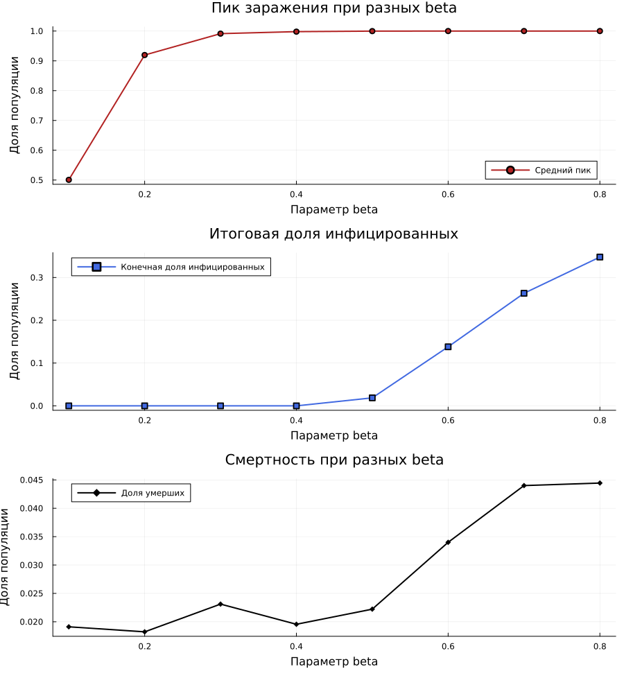{#fig-extra-comprehensive width=90%}

## Генерация производных материалов

Из literate-кода были сгенерированы:

- чистые скрипты в `scripts/clean/`;
- `Jupyter notebook` в `notebooks/`;
- `Quarto`-файлы в `markdown/`.

Оба notebook были выполнены через `nbconvert`, что подтверждает
воспроизводимость проекта.

На [рис. @fig-lab04-generate-01] показана генерация производных форматов для
базового literate-скрипта `01_sir_agents.jl`.

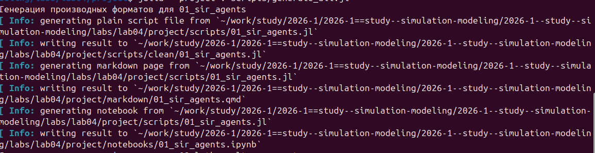{#fig-lab04-generate-01 width=90%}

На [рис. @fig-lab04-generate-batch-1] и [рис. @fig-lab04-generate-batch-2]
показаны последовательные фрагменты пакетной генерации literate-материалов.

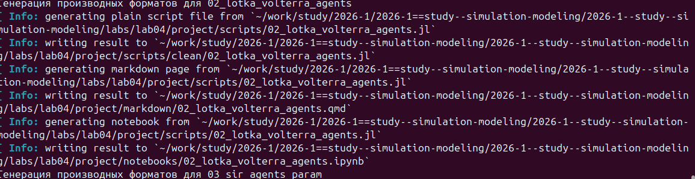{#fig-lab04-generate-batch-1 width=90%}

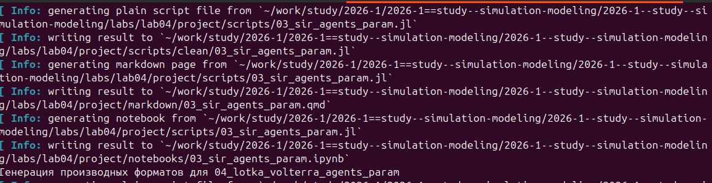{#fig-lab04-generate-batch-2 width=90%}

На [рис. @fig-lab04-generate-end] показано завершение пакетной генерации
производных материалов.

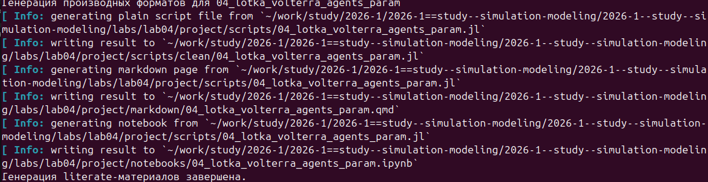{#fig-lab04-generate-end width=90%}

На [рис. @fig-lab04-generate-current] показана генерация файлов для текущих
скриптов `01_sir_agents.jl` и `02_sir_agents_param.jl`.

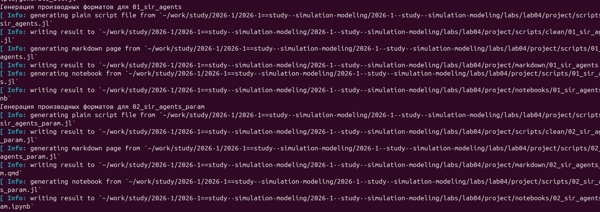{#fig-lab04-generate-current width=95%}

# Выводы

В лабораторной работе реализована модель болезни `SIR` в агентном подходе и
выполнено дополнительное параметрическое исследование. Получены графики
динамики состояний, фазовый портрет, график эффективного репродуктивного числа
и сравнительный график параметрических сценариев.

В дополнительном задании исследована расширенная многогородная SIR-модель с
миграцией, неоднородными коэффициентами передачи, карантином, поиском
эпидемического порога и подбором параметров. Построенные графики показали
хорошее согласование наблюдаемого порога с теоретическим условием `R0 = 1`,
сильное влияние миграции на масштаб вспышки и чувствительность итоговой
смертности к раннему выявлению инфекции.

Также были сгенерированы и выполнены производные форматы literate-кода:
чистые скрипты, notebook и Quarto-документация. Результаты всех основных и
дополнительных запусков интегрированы в итоговый отчёт.

# Список литературы{.unnumbered}

::: {#refs}
:::
