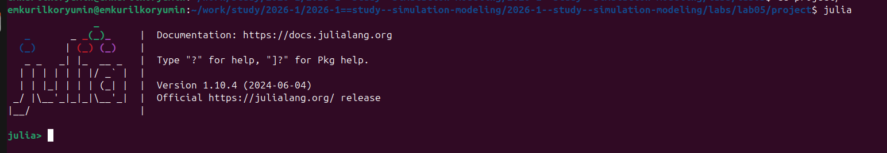
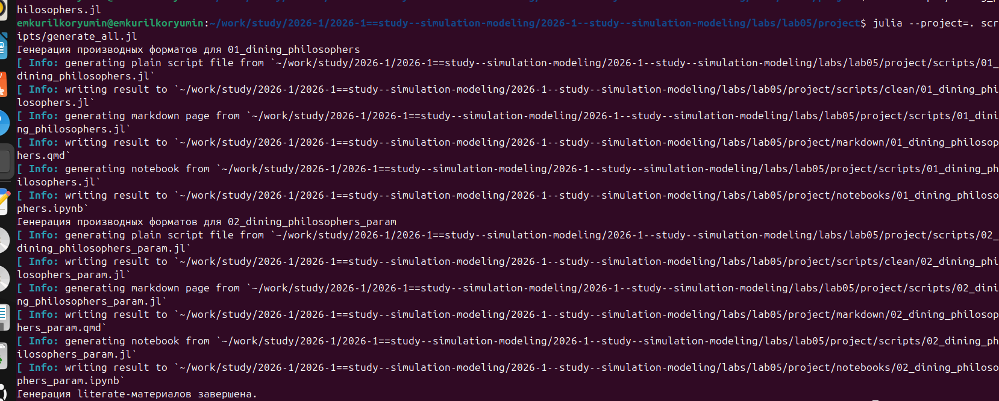
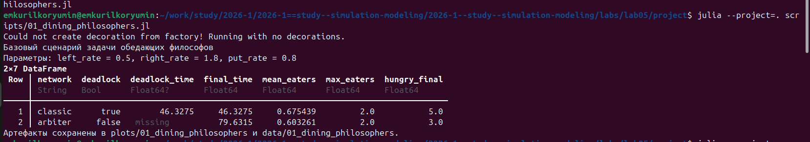
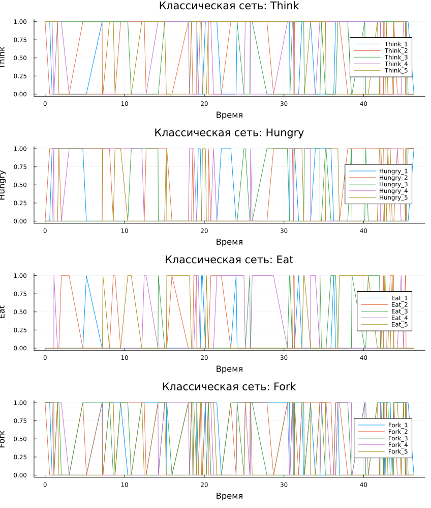
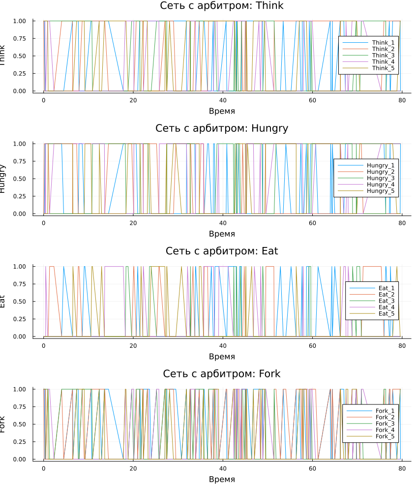
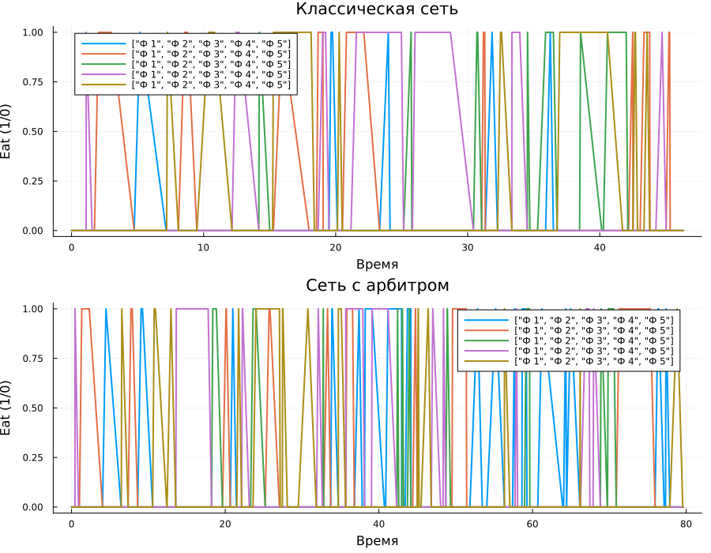
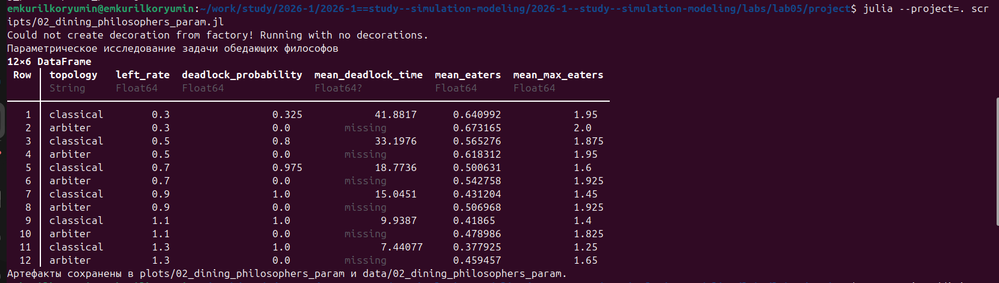
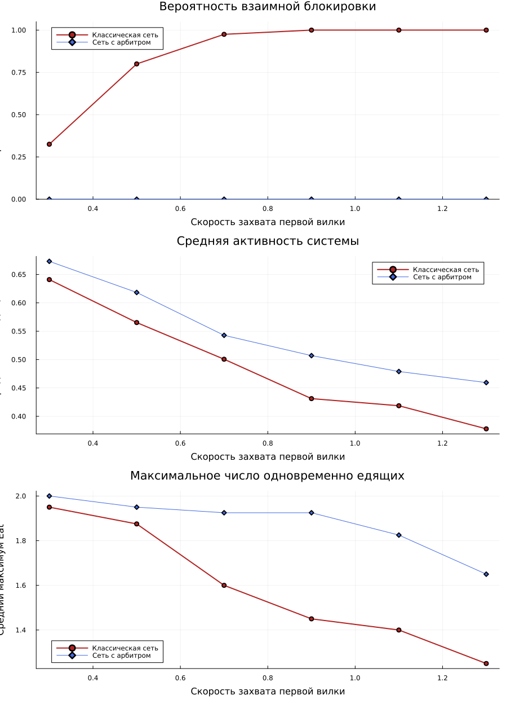
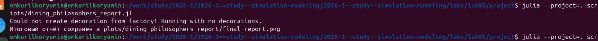

---
## Author
author:
  name: Курилко-Рюмин Евгений Михайлович
  degrees: student
  orcid: 0000-0002-0877-7063
  email: 1132232883@rudn.ru
  affiliation:
    - name: Российский университет дружбы народов
      country: Российская Федерация
      postal-code: 117198
      city: Москва
      address: ул. Миклухо-Маклая, д. 6

## Title
title: "Презентация по лабораторной работе №5"
subtitle: "Аппарат сетей Петри: задача обедающих философов"
license: "CC BY"
date: today
date-format: "YYYY-MM-DD"
format:
  beamer:
    incremental: false
  revealjs:
    incremental: false
---

# Информация

## Докладчик

::: {.columns align=center}
::: {.column width="65%"}

- Курилко-Рюмин Евгений Михайлович
- студент
- Российский университет дружбы народов им. П. Лумумбы
- [1132232883@rudn.ru](mailto:1132232883@rudn.ru)
- направление: математическое моделирование

:::
::: {.column width="35%"}

{width=90%}

:::
:::

# Постановка задачи

## Цель и состав работы

- реализовать задачу обедающих философов средствами сетей Петри;
- сравнить классическую схему и вариант с арбитром;
- получить воспроизводимые `jl`, `qmd`, `ipynb` и итоговые графики;
- показать, как меняется риск deadlock при варьировании параметров.

## Почему здесь удобны сети Петри

- позиции отражают состояния `Think`, `Hungry`, `Eat`, `Fork`;
- переходы описывают захват и освобождение ресурсов;
- deadlock интерпретируется как состояние, в котором ни один переход больше не разрешён;
- добавление позиции `Arbiter` меняет только логику доступа к ресурсам, не ломая остальную модель.

# Ход работы

## Подготовка вычислительной среды

::: {.columns align=center}
::: {.column width="45%"}

- работа велась в каталоге `labs/lab05/project`;
- использовались `Julia`, `DrWatson`, `Plots`, `CSV`, `DataFrames`;
- отдельно подготовлены сценарии для моделирования, постобработки и генерации материалов.

:::
::: {.column width="55%"}

{width=100%}

:::
:::

## Генерация производных материалов

::: {.columns align=center}
::: {.column width="52%"}

{width=100%}

:::
::: {.column width="48%"}

- literate-скрипты автоматически преобразованы в:
  - исполняемые `.jl`;
  - `Quarto`-документы;
  - `Jupyter notebook`;
- это позволило использовать один источник и для запуска, и для документирования.

:::
:::

## Что входит в проект лабораторной работы

- `src/DiningPhilosophers.jl` содержит модель сети и функции анализа;
- `scripts/01_dining_philosophers.jl` выполняет базовое сравнение;
- `scripts/02_dining_philosophers_param.jl` запускает серию экспериментов;
- `scripts/dining_philosophers_report.jl` строит итоговый график по `Eat_i`;
- `scripts/dining_philosophers_animation.jl` сохраняет GIF-анимацию процесса.

# Базовый эксперимент

## Параметры и итог одиночного прогона

- `N = 5`
- `tmax = 80`
- `left_rate = 0.5`
- `right_rate = 1.8`
- `put_rate = 0.8`

Итог:

- классическая сеть: deadlock при `t ≈ 46.33`;
- сеть с арбитром: траектория активна до `t ≈ 79.63`;
- максимум одновременно едящих философов в обоих случаях равен `2`.

## Выполнение базового сценария

::: {.columns align=center}
::: {.column width="54%"}

{width=100%}

:::
::: {.column width="46%"}

- терминальный вывод подтверждает запуск `01_dining_philosophers.jl`;
- сразу после прогона формируются `CSV`-данные и графики;
- сводка уже на этом этапе показывает различие между двумя топологиями.

:::
:::

## Сравнение эволюции маркировки

::: {.columns align=center}
::: {.column width="50%"}

{width=100%}

:::
::: {.column width="50%"}

{width=100%}

:::
:::

## Что показывает базовый прогон

::: {.columns align=center}
::: {.column width="42%"}

- классическая сеть постепенно вырождается в тупик;
- в модификации с арбитром остаётся чередование состояний;
- среднее число едящих:
  - `0.675` в классической сети;
  - `0.603` в сети с арбитром.

:::
::: {.column width="58%"}

{width=100%}

:::
:::

# Набор параметров

## Постановка серии запусков

- фиксировано: `N = 5`, `right_rate = 1.8`, `put_rate = 0.8`, `tmax = 80`;
- менялся только `left_rate`;
- диапазон: от `0.3` до `1.3`;
- для каждого случая выполнялось по `40` стохастических прогонов.

## Терминальный результат параметрической серии

::: {.columns align=center}
::: {.column width="54%"}

{width=100%}

:::
::: {.column width="46%"}

- уже по консольной таблице видно, что при росте `left_rate` классическая сеть
  теряет устойчивость;
- для сети с арбитром deadlock не фиксируется ни разу.

:::
:::

## Графический итог серии запусков

::: {.columns align=center}
::: {.column width="42%"}

- вероятность deadlock в классической сети растёт от `0.325` до `1.0`;
- среднее время до тупика уменьшается от `41.88` до `7.44`;
- арбитр удерживает вероятность deadlock на уровне `0`;
- активность сети с арбитром на всём диапазоне параметров выше.

:::
::: {.column width="58%"}

{width=100%}

:::
:::

# Постобработка и выводы

## Построение итогового отчёта

::: {.columns align=center}
::: {.column width="52%"}

{width=100%}

:::
::: {.column width="48%"}

- после основных прогонов отдельно запускается `dining_philosophers_report.jl`;
- он строит сводный график по состояниям `Eat_i` на основе сохранённых `CSV`;
- дополнительно формируется анимация изменения маркировки.

:::
:::

## Основные выводы

- задача обедающих философов успешно реализована в аппарате сетей Петри;
- классическая сеть подтверждает возможность deadlock;
- введение арбитра устраняет тупик на всём исследованном диапазоне параметров;
- literate-скрипты, графики, скриншоты и отчёт образуют воспроизводимый комплект материалов.
