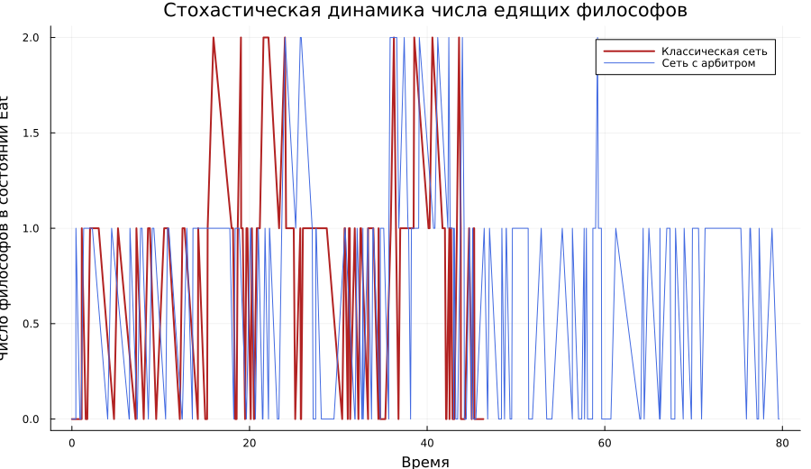

---
## Author
author:
  name: Курилко-Рюмин Евгений Михайлович
  degrees: student
  orcid: 0000-0002-0877-7063
  email: 1132232883@rudn.ru
  affiliation:
    - name: Российский университет дружбы народов
      country: Российская Федерация
      postal-code: 117198
      city: Москва
      address: ул. Миклухо-Маклая, д. 6

## Title
title: "Отчёт по лабораторной работе №5"
subtitle: "Аппарат сетей Петри: задача обедающих философов"
license: "CC BY"
---

# Цель работы

Целью работы является построение и исследование модели задачи обедающих
философов в аппарате сетей Петри, сравнение классической схемы и варианта с
арбитром, а также подготовка воспроизводимых программных материалов и отчёта
по результатам вычислительных экспериментов.

# Задание

В ходе лабораторной работы требовалось:

1. Подготовить проект `Julia` в структуре `DrWatson`.
2. Реализовать модель сети Петри для задачи обедающих философов.
3. Сформировать literate-версии основных сценариев.
4. Выполнить базовый вычислительный эксперимент для двух топологий сети.
5. Провести серию запусков для набора параметров.
6. Построить графики, итоговый сравнительный отчёт и анимацию.
7. Включить результаты выполнения в итоговый документ.

# Теоретическое введение

Сеть Петри представляет собой ориентированную двудольную структуру, в которой
позиции описывают состояния системы, переходы моделируют события, а маркировка
задаёт текущее распределение фишек по позициям. Такой аппарат удобен для
описания параллельных процессов, конфликтов за ресурсы и ситуаций взаимной
блокировки [@murata1989petri].

Задача обедающих философов является классическим примером конкуренции за
разделяемые ресурсы и потому естественно формулируется средствами сетей
Петри [@korolkova2026simulation]. Для каждого философа в модели используются
состояния `Think_i`, `Hungry_i` и `Eat_i`, а для каждой вилки вводится позиция
`Fork_i`. В классической сети каждый философ может одновременно перейти к
захвату первой вилки, из-за чего система способна попасть в тупик. В
модифицированной схеме добавляется позиция `Arbiter` с `N - 1` фишками; она
ограничивает число одновременно претендующих на ресурсы философов и тем самым
разрушает конфигурацию deadlock.

В реализованном проекте рассматриваются две формы динамики:

- стохастическая симуляция по схеме Гиллеспи;
- детерминированная `ODE`-аппроксимация как дополнительный аналитический слой.

# Выполнение лабораторной работы

## Подготовка среды и исходных материалов

Работа велась в каталоге `labs/lab05/project`. В начале была запущена среда
`Julia`, после чего активировано окружение проекта и подготовлены зависимости,
необходимые для моделирования, визуализации и генерации производных
материалов.

{#fig-lab05-julia width=98%}

Структура лабораторной работы организована вокруг нескольких ключевых файлов.

| Файл | Назначение |
|---|---|
| `src/DiningPhilosophers.jl` | описание сети Петри, функции симуляции и анализа |
| `scripts/01_dining_philosophers.jl` | базовый сценарий сравнения двух сетей |
| `scripts/02_dining_philosophers_param.jl` | серия прогонов для набора параметров |
| `scripts/dining_philosophers_report.jl` | построение итогового сравнительного графика |
| `scripts/dining_philosophers_animation.jl` | генерация анимации изменения маркировки |
| `scripts/generate_all.jl` | создание `clean`, `qmd` и `ipynb` производных файлов |

: Основные артефакты лабораторной работы {#tbl-lab05-files}

После подготовки исходников были сгенерированы производные форматы.

{#fig-lab05-generate-start width=98%}

{#fig-lab05-generate-end width=98%}

Из этих скриншотов видно, что из literate-скриптов были автоматически
получены исполняемые файлы, `Quarto`-документы и `Jupyter notebook`, которые
затем использовались как единый воспроизводимый комплект материалов.

## Базовый вычислительный эксперимент

Базовый сценарий был реализован в файле `scripts/01_dining_philosophers.jl`.
Для прямого сравнения двух топологий использовались одинаковые параметры:

- число философов `N = 5`;
- горизонт моделирования `tmax = 80`;
- скорость захвата первой вилки `left_rate = 0.5`;
- скорость захвата второй вилки `right_rate = 1.8`;
- скорость возврата вилок `put_rate = 0.8`;
- одинаковое начальное зерно генератора случайных чисел.

Запуск основного сценария и полученная сводка показаны на
[рис. @fig-lab05-basic-run] и [рис. @fig-lab05-basic-summary].

{#fig-lab05-basic-run width=98%}

{#fig-lab05-basic-summary width=98%}

Численные итоги базового прогона сведены в [табл. @tbl-lab05-basic].

| Сеть | Наличие deadlock | Время завершения траектории | Среднее число едящих | Максимум `Eat` | Число голодных в финале |
|---|---|---:|---:|---:|---:|
| Классическая | `true` | 46.33 | 0.675 | 2.0 | 5 |
| С арбитром | `false` | 79.63 | 0.603 | 2.0 | 3 |

: Сводка базового вычислительного эксперимента {#tbl-lab05-basic}

Далее были построены графики эволюции маркировки по основным группам
состояний для классической и модифицированной сети.

{#fig-lab05-classic width=92%}

{#fig-lab05-arbiter width=92%}

На [рис. @fig-lab05-classic] видно, что в классической постановке система
сначала демонстрирует чередование состояний, однако к концу прогона все
философы оказываются в режиме ожидания, а число свободных вилок обнуляется.
На [рис. @fig-lab05-arbiter] динамика остаётся живой на всём интервале:
позиция `Arbiter` не допускает одновременного входа всех философов в опасную
конфигурацию.

Для более компактного сравнения использовались суммарные характеристики по
состоянию `Eat`.

{#fig-lab05-eat-compare width=90%}

{#fig-lab05-ode width=90%}

Стохастический график на [рис. @fig-lab05-eat-compare] показывает принципиальное
расхождение сценариев: в классической сети кривая уходит к нулю и перестаёт
меняться, тогда как в сети с арбитром сохраняются колебания. `ODE`-аппроксимация
на [рис. @fig-lab05-ode] воспроизводит ту же качественную тенденцию и
подтверждает более высокую устойчивость модифицированной модели.

## Серия запусков для набора параметров

Вторая часть работы была посвящена серии стохастических прогонов, где
изменялась скорость захвата первой вилки. Этот параметр напрямую влияет на
то, насколько быстро философы входят в конфликт за ресурсы.

Фиксированными оставались:

- `N = 5`;
- `right_rate = 1.8`;
- `put_rate = 0.8`;
- `tmax = 80`;
- число прогонов для каждого случая `40`.

Перебирался набор значений

$$
left\_rate \in \{0.3,\;0.5,\;0.7,\;0.9,\;1.1,\;1.3\}.
$$

Командный запуск сценария `02_dining_philosophers_param.jl` и часть его
результатов представлены на [рис. @fig-lab05-param-run] и
[рис. @fig-lab05-param-summary].

{#fig-lab05-param-run width=98%}

{#fig-lab05-param-summary width=98%}

Сводные численные показатели приведены в [табл. @tbl-lab05-param].

| `left_rate` | Вероятность deadlock, классическая | Среднее время deadlock, классическая | Среднее число едящих, классическая | Вероятность deadlock, арбитр | Среднее число едящих, арбитр |
|---:|---:|---:|---:|---:|---:|
| 0.3 | 0.325 | 41.88 | 0.641 | 0.0 | 0.673 |
| 0.5 | 0.800 | 33.20 | 0.565 | 0.0 | 0.618 |
| 0.7 | 0.975 | 18.77 | 0.501 | 0.0 | 0.543 |
| 0.9 | 1.000 | 15.05 | 0.431 | 0.0 | 0.507 |
| 1.1 | 1.000 | 9.94 | 0.419 | 0.0 | 0.479 |
| 1.3 | 1.000 | 7.44 | 0.378 | 0.0 | 0.459 |

: Результаты серии запусков для набора параметров {#tbl-lab05-param}

{#fig-lab05-param-panel width=92%}

По [табл. @tbl-lab05-param] и [рис. @fig-lab05-param-panel] можно сделать три
основных вывода:

1. При росте `left_rate` классическая сеть всё быстрее переходит в тупиковое
   состояние.
2. Одновременно уменьшается средняя активность системы, то есть число
   философов в состоянии `Eat`.
3. Сеть с арбитром сохраняет нулевую вероятность deadlock на всём исследованном
   диапазоне значений.

## Постобработка результатов и итоговые артефакты

После завершения вычислительных экспериментов выполнялась отдельная
постобработка сохранённых данных. Для этого использовался скрипт
`scripts/dining_philosophers_report.jl`, который строил итоговый сравнительный
график по состояниям `Eat_i` на основе ранее созданных `CSV`-файлов.

{#fig-lab05-final-script width=98%}

{#fig-lab05-final width=90%}

Именно этот график наиболее наглядно разделяет два сценария. Для классической
сети кривые довольно быстро замирают на нуле, что отражает потерю живости.
Для сети с арбитром сохраняются повторяющиеся пики, то есть возможность
приёма пищи остаётся доступной до конца моделирования.

Кроме того, был подготовлен анимационный файл
`plots/dining_philosophers_animation/philosophers_simulation.gif`. Он не
используется как основной источник количественного анализа, но удобен для
визуального просмотра того момента, когда классическая сеть прекращает
изменять маркировку.

## Обсуждение полученных результатов

По сравнению с краткой схемой выполнения лабораторной работы здесь были
разнесены три уровня анализа:

- фиксированный базовый прогон, позволяющий увидеть одиночную траекторию;
- серия запусков для набора параметров, показывающая устойчивость наблюдаемого
  эффекта;
- отдельная постобработка, в которой результаты сводятся к удобным итоговым
  графикам и артефактам документации.

Такое представление отличается от эталонного образца по композиции, однако
сохраняет его академическую логику: сначала показывается подготовка среды,
затем ход эксперимента, после чего отдельно обсуждаются результаты и выводы.
Добавленные терминальные скриншоты фиксируют реальное выполнение сценариев,
генерацию literate-материалов и сборку итоговых графиков.

# Выводы

В ходе лабораторной работы задача обедающих философов была успешно
смоделирована средствами сетей Петри, а результаты оформлены в виде
воспроизводимого вычислительного проекта.

1. Реализованы классическая сеть и её модификация с арбитром.
2. Подготовлены literate-скрипты, исполняемые файлы, `Jupyter notebook` и
   `Quarto`-документы.
3. Базовый сценарий показал возникновение deadlock в классической сети при
   сохранении работоспособности модели с арбитром.
4. Серия запусков подтвердила, что увеличение скорости захвата первой вилки
   резко ухудшает устойчивость классической сети, тогда как наличие арбитра
   удерживает вероятность тупика на нуле.
5. Итоговые графики, таблицы, скриншоты и анимация позволяют считать
   лабораторную работу полностью воспроизводимой и документированной.

# Список литературы{.unnumbered}

::: {#refs}
:::
