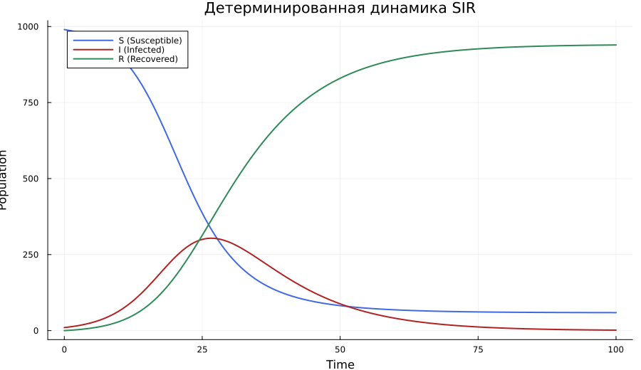
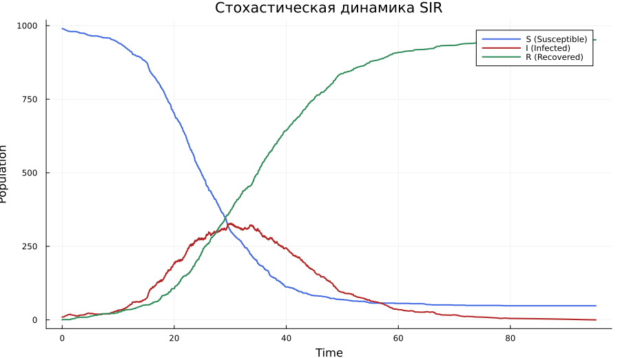
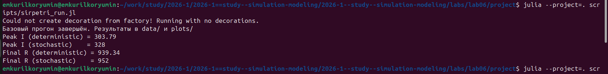
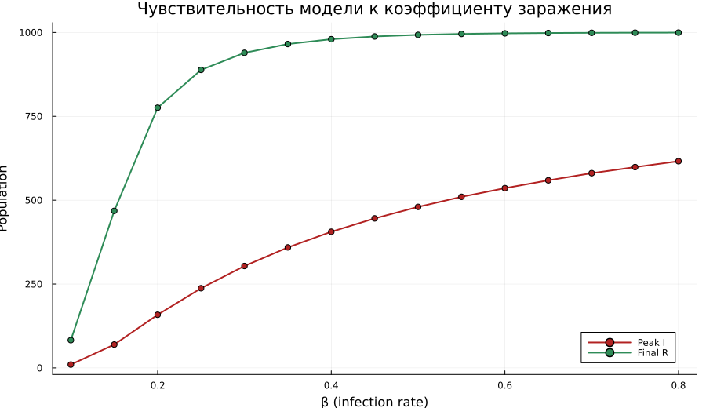
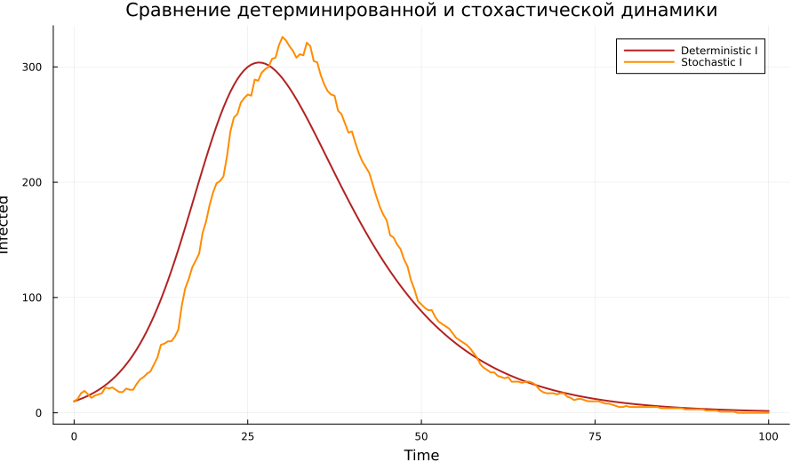
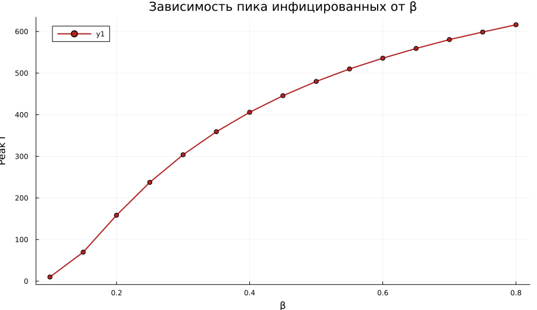

---
## Author
author:
  name: Курилко-Рюмин Евгений Михайлович
  degrees: student
  orcid: 0000-0002-0877-7063
  email: 1132232883@rudn.ru
  affiliation:
    - name: Российский университет дружбы народов
      country: Российская Федерация
      postal-code: 117198
      city: Москва
      address: ул. Миклухо-Маклая, д. 6

## Title
title: "Отчёт по лабораторной работе №6"
subtitle: "Реализация модели SIR в подходе сетей Петри"
license: "CC BY"
---

# Цель работы

Целью работы является реализация эпидемиологической модели `SIR`
средствами сетей Петри, сравнение детерминированной и стохастической
динамики эпидемии, а также подготовка воспроизводимого проекта с
`literate`-скриптами, `Jupyter notebook`, `Quarto`-документацией и итоговым
отчётом.

# Задание

В ходе лабораторной работы требовалось:

1. Создать рабочий каталог для кода в структуре `DrWatson`.
2. Установить необходимые пакеты и выполнить предложенный код модели `SIR`.
3. Подготовить literate-версии базового сценария и сценария для набора
   параметров.
4. Сгенерировать из literate-кода чистые `jl`-файлы, `ipynb` и `qmd`.
5. Выполнить код из `Jupyter notebook`.
6. Исследовать чувствительность модели к изменению коэффициента заражения `β`.
7. Построить графики, анимацию и итоговый сравнительный отчёт.
8. Интегрировать результаты в итоговый документ `Quarto`.

# Исследовательская постановка

В этой лабораторной работе важно было не просто реализовать модель `SIR`,
а проследить, как одна и та же сеть Петри ведёт себя в двух режимах
симуляции. Первый режим даёт сглаженную детерминированную траекторию,
второй — стохастическую реализацию с флуктуациями. Дополнительно
исследовалось влияние коэффициента заражения `β` на форму эпидемической
волны.

Таким образом, вычислительный эксперимент строился вокруг двух вопросов:

1. насколько согласуются детерминированная и стохастическая версии модели;
2. как изменение `β` влияет на пик инфекции и итоговое число переболевших.

# Теоретическая основа модели

Классическая модель `SIR`, предложенная Кермаком и Маккендриком,
разбивает популяцию на три группы: восприимчивые `S`, инфицированные `I`
и выздоровевшие `R` [@kermack1927contribution]. Переходы между состояниями
в простейшей постановке задаются двумя реакциями:

- заражение: `S + I → I + I` со скоростью `β`;
- выздоровление: `I → R` со скоростью `γ`.

Сети Петри удобны для такого описания, потому что позиции естественным
образом представляют состояния системы, а переходы моделируют события и
изменение маркировки [@murata1989petri]. В данной лабораторной работе
использовалась минимальная сеть из трёх позиций (`S`, `I`, `R`) и двух
переходов (`infection`, `recovery`), что позволило описать как
детерминированную, так и стохастическую версию одной и той же модели
[@korolkova2026simulation].

Детерминированная симуляция строится по закону действующих масс и приводит
к системе обыкновенных дифференциальных уравнений

$$
\frac{dS}{dt} = -\beta \frac{S I}{N},\quad
\frac{dI}{dt} = \beta \frac{S I}{N} - \gamma I,\quad
\frac{dR}{dt} = \gamma I.
$$

Из этих уравнений следует ожидаемое поведение системы: при увеличении `β`
эпидемическая волна должна становиться интенсивнее, а стохастическая версия
должна сохранять общую форму процесса, но демонстрировать случайные
отклонения относительно сглаженной траектории.

# Ход вычислительного исследования

## Архитектура проекта и реализация модели

Работа выполнялась в каталоге `labs/lab06/project`, организованном в
структуре `DrWatson`. В окружении использовались `DrWatson`, `CSV`,
`DataFrames`, `Plots`, `OrdinaryDiffEq`, `Literate` и `IJulia`.

Основная логика модели размещена в `src/SIRPetri.jl`. В этом модуле заданы:

- построение сети `build_sir_network`;
- детерминированная симуляция `simulate_deterministic`;
- стохастическая симуляция `simulate_stochastic`;
- функции визуализации `plot_sir`, `plot_compare_infected`, `plot_scan`;
- функция анимации `animate_sir`.

Для проведения экспериментов и постобработки использовались следующие
файлы:

| Файл | Назначение |
|---|---|
| `src/SIRPetri.jl` | описание модели `SIR` в подходе сетей Петри |
| `scripts/sirpetri_run.jl` | базовый literate-сценарий |
| `scripts/sirpetri_scan_parameters.jl` | исследование набора параметров |
| `scripts/sirpetri_animate.jl` | построение GIF-анимации |
| `scripts/sirpetri_report.jl` | построение итоговых графиков |
| `scripts/generate_all.jl` | генерация `clean`, `qmd` и `ipynb` |

: Основные файлы лабораторной работы {#tbl-lab06-files}

На этапе подготовки проекта отдельно были проверены окружение и ключевые
исходные файлы, определяющие общую структуру лабораторной работы. На
[рис. @fig-lab06-env-screen] показана инициализация зависимостей проекта, а
на [рис. @fig-lab06-module-screen]--[рис. @fig-lab06-post-screen] --
просмотр основного модуля модели и сценариев, отвечающих за эксперимент и
постобработку результатов.

{#fig-lab06-env-screen width=100%}

{#fig-lab06-module-screen width=100%}

{#fig-lab06-main-screen width=100%}

{#fig-lab06-post-screen width=100%}

## План вычислительного эксперимента

Исследование было организовано в три этапа. Сначала выполнялся базовый
запуск при фиксированных параметрах, чтобы сравнить детерминированную и
стохастическую динамику. Затем проводилась серия запусков с варьированием
коэффициента заражения `β`. После этого строились итоговые графики,
анимация и производные материалы для последующего документирования.

Такая последовательность позволила сначала проверить корректность общей
картины поведения модели, а затем перейти к анализу чувствительности.

## Базовое сравнение детерминированной и стохастической динамики

Базовый запуск реализован в файле `scripts/sirpetri_run.jl`. Для него
использовались параметры:

- коэффициент заражения `β = 0.3`;
- коэффициент выздоровления `γ = 0.1`;
- горизонт моделирования `tmax = 100.0`;
- начальная маркировка `S₀ = 990`, `I₀ = 10`, `R₀ = 0`.

В этом сценарии сразу строились две траектории:

- детерминированная `ODE`-аппроксимация;
- стохастическая реализация по алгоритму Гиллеспи.

Результаты сохранялись в файлы `data/sir_det.csv` и `data/sir_stoch.csv`,
после чего строились графики [рис. @fig-lab06-det] и
[рис. @fig-lab06-stoch].

{#fig-lab06-det width=92%}

{#fig-lab06-stoch width=92%}

{#fig-lab06-base-screen width=100%}

Сравнение показало, что обе версии модели воспроизводят одну и ту же общую
логику развития эпидемии: рост числа инфицированных, достижение максимума и
последующий спад. При этом стохастическая траектория не совпадает с
детерминированной точка в точку, а демонстрирует естественные флуктуации,
особенно заметные вблизи пика. Терминальный вывод на
[рис. @fig-lab06-base-screen] дополнительно фиксирует численные значения
пика инфекции и итогового числа выздоровевших для двух режимов симуляции.

## Чувствительность модели к коэффициенту заражения

Во второй части исследования использовался сценарий
`scripts/sirpetri_scan_parameters.jl`, в котором параметр `β` изменялся в
диапазоне от `0.1` до `0.8` с шагом `0.05`, тогда как `γ = 0.1` оставался
фиксированным.

Для каждого запуска вычислялись:

- пик числа инфицированных `peak_I`;
- конечное число выздоровевших `final_R`.

Результаты сохранялись в `data/sir_scan.csv`, а графическое сравнение
строилось в `plots/sir_scan.png` ([рис. @fig-lab06-scan]).

{#fig-lab06-scan width=92%}

{#fig-lab06-scan-screen width=100%}

Полученная зависимость показывает, что коэффициент заражения является
основным рычагом управления формой эпидемической волны. При малых значениях
`β` вспышка остаётся сравнительно слабой, а с ростом заразности максимум
числа инфицированных быстро увеличивается. Конечное число выздоровевших тоже
возрастает и при больших `β` выходит на насыщение, что соответствует
прохождению почти всей популяции через состояние `I`. Табличная сводка на
[рис. @fig-lab06-scan-screen] показывает те же результаты в виде набора
численных оценок `peak_I` и `final_R` для всего диапазона исследованных
значений `β`.

## Визуальные материалы и итоговая интерпретация

Для дополнительной наглядности был выполнен сценарий
`scripts/sirpetri_animate.jl`, формирующий файл `plots/sir_animation.gif`.
Анимация не заменяет количественный анализ, но хорошо показывает, как
эпидемическая волна последовательно перераспределяет население между
состояниями `S`, `I` и `R`.

После завершения основных расчётов был выполнен сценарий
`scripts/sirpetri_report.jl`. Он строил два итоговых графика:

1. сравнение детерминированной и стохастической динамики `I(t)`;
2. зависимость пика инфицированных от коэффициента заражения `β`.

Полученные результаты представлены на [рис. @fig-lab06-comparison] и
[рис. @fig-lab06-sensitivity].

{#fig-lab06-comparison width=92%}

{#fig-lab06-sensitivity width=92%}

{#fig-lab06-visual-screen width=100%}

Эти визуализации позволяют уже не просто перечислить результаты отдельных
скриптов, а собрать их в единую интерпретацию: модель корректно воспроизводит
структуру эпидемической волны, а изменение `β` заметно перестраивает её
масштаб и интенсивность. Дополнительно терминальный фрагмент на
[рис. @fig-lab06-visual-screen] фиксирует успешное сохранение анимации и
итоговых графических материалов проекта.

## Воспроизводимость и производные форматы

Для генерации производных материалов использовался сценарий
`scripts/generate_all.jl`. На его основе автоматически формировались:

- чистые `.jl`-файлы;
- `Quarto`-документы;
- `Jupyter notebook`.

{#fig-lab06-literate-screen width=100%}

По завершении лабораторной работы были сформированы:

- `scripts/clean/sirpetri_run.jl` и `scripts/clean/sirpetri_scan_parameters.jl`;
- `markdown/sirpetri_run.qmd` и `markdown/sirpetri_scan_parameters.qmd`;
- `notebooks/sirpetri_run.ipynb` и `notebooks/sirpetri_scan_parameters.ipynb`;
- таблицы `sir_det.csv`, `sir_stoch.csv`, `sir_scan.csv`;
- графики `sir_det_dynamics.png`, `sir_stoch_dynamics.png`, `sir_scan.png`,
  `comparison.png`, `sensitivity.png`;
- анимация `sir_animation.gif`.

Отдельно были выполнены `Jupyter notebook`, сгенерированные из
literate-скриптов, что подтвердило воспроизводимость результатов не только
в виде отдельных `.jl`-файлов, но и в notebook-формате. Скриншот на
[рис. @fig-lab06-literate-screen] показывает сам процесс генерации всех
основных производных форматов из исходных literate-материалов. В итоге
работа оформлена как единый вычислительный проект, в котором код,
результаты, визуализация и документация остаются согласованными между
собой.

# Выводы

В ходе лабораторной работы была реализована модель `SIR` в подходе сетей
Петри и подготовлен воспроизводимый вычислительный проект, объединяющий код
модели, сценарии запуска, графические результаты и документацию. Такой
формат работы позволил рассматривать лабораторную не как единичный запуск
отдельного скрипта, а как целостный вычислительный эксперимент.

Базовый сценарий показал, что детерминированная и стохастическая версии
модели качественно согласуются между собой: в обоих случаях наблюдаются рост
инфекции, достижение максимума и последующий спад эпидемической волны. При
этом стохастическая траектория, в отличие от сглаженной детерминированной,
отражает влияние случайных флуктуаций на развитие процесса.

Параметрическое исследование коэффициента заражения `β` подтвердило, что
именно этот параметр существенно влияет на форму эпидемической волны. При
малых значениях `β` вспышка развивается слабо, тогда как при увеличении
заразности быстро возрастают как пик числа инфицированных, так и итоговая
доля переболевших. Это указывает на выраженную чувствительность модели к
изменению интенсивности заражения.

Дополнительно в ходе работы были автоматически сформированы производные
материалы: `clean`-скрипты, `Quarto`-документы, `Jupyter notebook`,
итоговые графики и анимация. В результате лабораторная работа оформлена в
виде набора согласованных и воспроизводимых артефактов, удобных для
последующего анализа, проверки и защиты.

# Список литературы{.unnumbered}

::: {#refs}
:::
