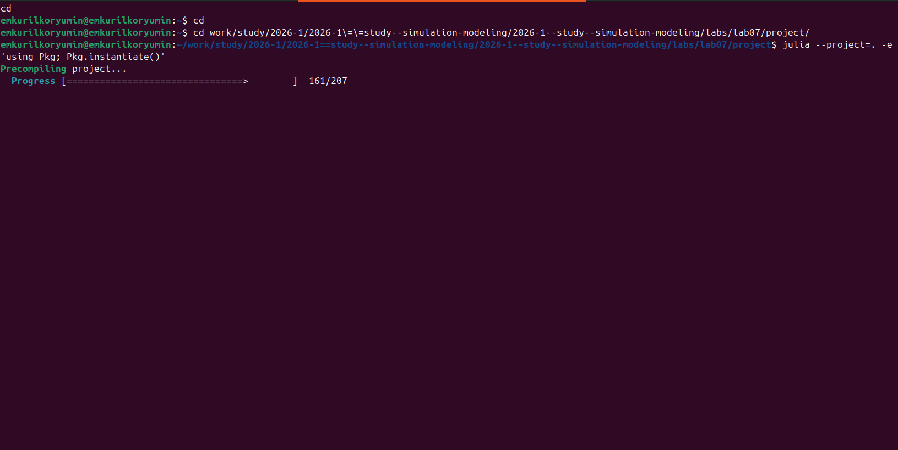
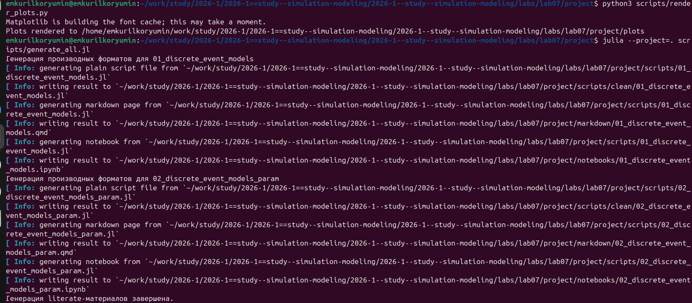

# Цель работы

- Реализовать модели `M/M/c` и Росса средствами дискретно-событийного моделирования
- Подготовить воспроизводимый проект `DrWatson`
- Построить графики и сравнить имитацию с аналитикой

# Задание

- Выполнить базовый код модели `M/M/c`
- Добавить графики для многоканальной очереди
- Расширить модель Росса до нескольких ремонтников
- Провести серию прогонов при разном числе машин
- Оценить загрузку ремонтников и длину очереди на ремонт
- Подготовить `literate`, `ipynb` и `qmd`

# Архитектура проекта

- `src/DiscreteEventLab07Core.jl` — модуль с двумя моделями
- `scripts/01_discrete_event_models.jl` — базовые сценарии
- `scripts/02_discrete_event_models_param.jl` — параметрические эксперименты
- `scripts/generate_all.jl` — генерация `clean`, `qmd`, `ipynb`
- `test/runtests.jl` — базовые проверки

# Подготовка окружения

:::: {.columns}
::: {.column width="50%"}
{width=100%}
:::
::: {.column width="50%"}
{width=100%}
:::
::::

- Слева показан запуск `Pkg.instantiate()` в каталоге проекта
- Справа видно успешное завершение предкомпиляции зависимостей

# Модель `M/M/c`

- Параметры базового сценария:
  - `c = 2`
  - `λ = 0.85`
  - `μ = 0.5`
  - `1500` заявок
- Рассчитывались:
  - среднее время ожидания
  - среднее время в системе
  - вероятность ожидания
  - средняя длина очереди

# Консольные запуски сценариев

:::: {.columns}
::: {.column width="50%"}
{width=100%}
:::
::: {.column width="50%"}
{width=100%}
:::
::::

- Слева: базовый запуск `M/M/c` и модели Росса
- Справа: параметрический прогон с серией экспериментов

# Результаты `M/M/c`

{width=90%}

{width=90%}

# Модель Росса

- `N` основных машин и `S` резервных машин
- отказавшая машина уходит в ремонт
- при отсутствии резерва система падает
- в лабораторной работе добавлены несколько ремонтников
- дополнительно измерялись:
  - средняя загрузка ремонтников
  - средняя длина очереди
  - среднее время до отказа

# Результаты модели Росса

{width=90%}

{width=90%}

# Таблицы и генерация материалов

:::: {.columns}
::: {.column width="50%"}
{width=100%}
:::
::: {.column width="50%"}
{width=100%}
:::
::::

- Слева: итоговая таблица параметрического исследования модели Росса
- Справа: генерация графиков, `clean`, `qmd` и `ipynb`

# Основные выводы

- Модель `M/M/c` воспроизводит ожидаемый рост ожидания при увеличении `λ`
- Имитация `M/M/c` качественно согласуется с формулами Эрланга `C`
- В модели Росса увеличение числа ремонтников повышает устойчивость системы
- При росте числа машин увеличиваются загрузка ремонтников и очередь на ремонт
- Имитационные оценки времени до отказа согласуются с аналитическим решением
