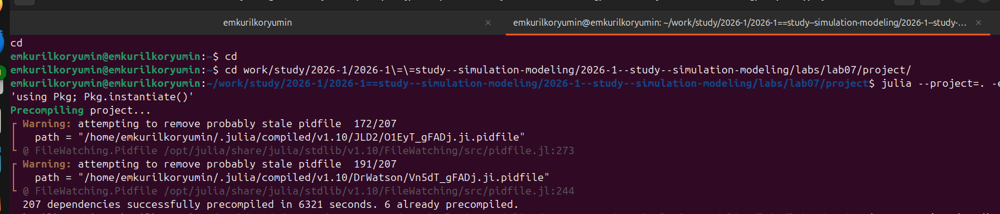
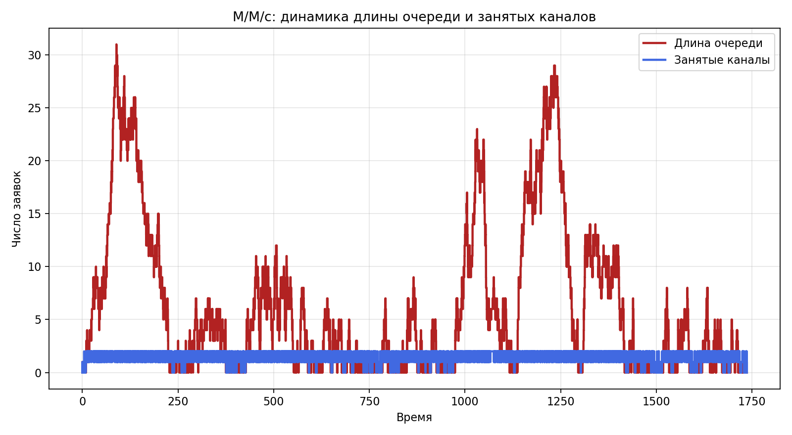
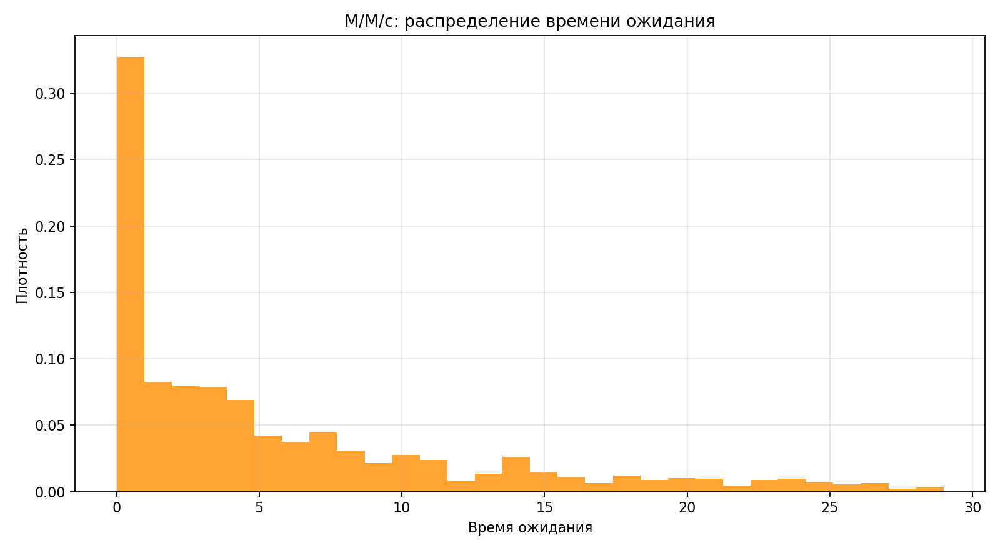
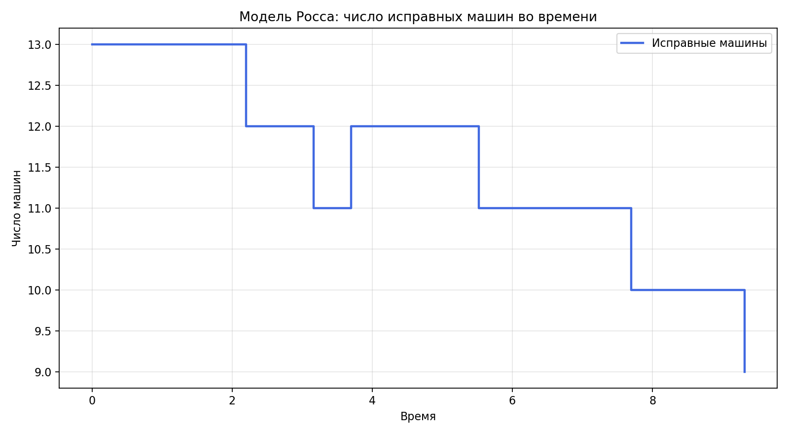
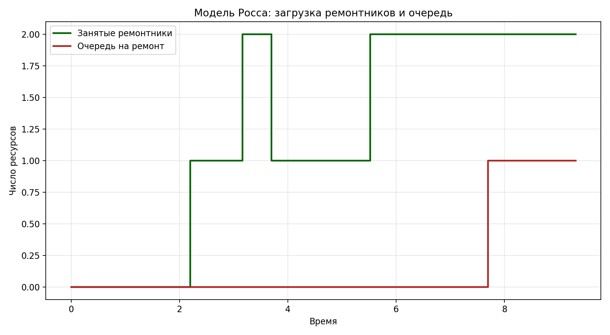
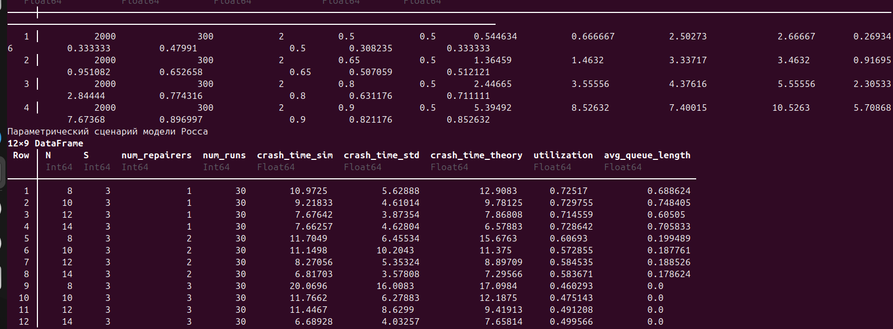
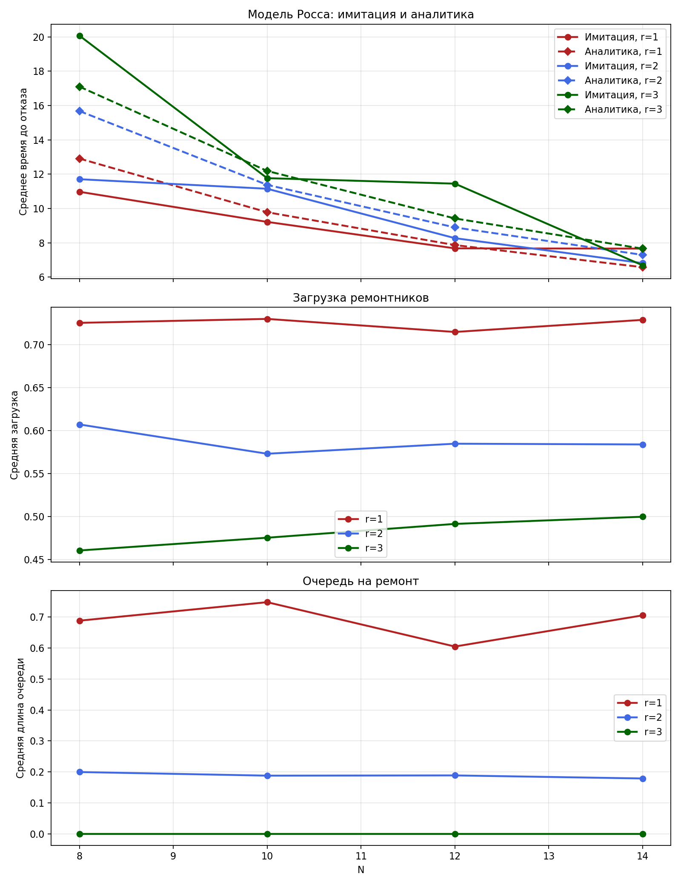

---
## Author
author:
  name: Курилко-Рюмин Евгений Михайлович
  degrees: student
  orcid: 0000-0002-0877-7063
  email: 1132232883@rudn.ru
  affiliation:
    - name: Российский университет дружбы народов
      country: Российская Федерация
      postal-code: 117198
      city: Москва
      address: ул. Миклухо-Маклая, д. 6

## Title
title: "Отчёт по лабораторной работе №7"
subtitle: "Дискретно-событийное моделирование"
license: "CC BY"
---

# Цель работы

Целью работы является реализация двух дискретно-событийных моделей —
системы массового обслуживания `M/M/c` и ремонтной модели Росса — в виде
воспроизводимого проекта `DrWatson`, проведение базовых и параметрических
вычислительных экспериментов, построение графиков и подготовка literate-
материалов, `Jupyter notebook` и документации `Quarto`.

# Задание

В ходе лабораторной работы требовалось:

1. Создать рабочий каталог проекта в структуре `DrWatson`.
2. Подключить необходимые пакеты для дискретно-событийного моделирования.
3. Выполнить предложенный код для модели `M/M/c`.
4. Выполнить и расширить модель Росса, добавив нескольких ремонтников.
5. Построить графики для двух моделей.
6. Провести серию прогонов модели Росса при разном числе машин.
7. Выполнить мониторинг загрузки ремонтников и средней длины очереди на
   ремонт.
8. Сравнить имитационные результаты модели Росса с аналитическим решением.
9. Подготовить literate-код, `clean`-скрипты, `ipynb` и `qmd`.
10. Интегрировать результаты в итоговый отчёт.

# Теоретическое введение

## Система массового обслуживания `M/M/c`

Модель `M/M/c` описывает очередь с пуассоновским потоком заявок,
экспоненциальным временем обслуживания и `c` параллельными каналами.
Условие существования стационарного режима имеет вид

$$
\lambda < c \mu,
$$

где `λ` — интенсивность поступления заявок, а `μ` — интенсивность
обслуживания одним каналом. В лабораторной работе кроме самой имитации
использовались классические формулы Эрланга `C`, позволяющие вычислить
вероятность ожидания и среднее время ожидания в очереди.

Для базового сценария важны следующие показатели:

- среднее время ожидания заявки;
- среднее время пребывания заявки в системе;
- средняя длина очереди;
- загрузка каналов обслуживания;
- вероятность того, что заявка вообще будет ждать.

## Модель Росса

Модель Росса рассматривает систему из `N` основных машин и `S` резервных
машин. Каждая работающая машина через случайное время выходит из строя.
Если имеется резерв, сломанная машина немедленно заменяется запасной и
отправляется в ремонт. Если резерва нет, система падает и моделирование
завершается.

В расширении лабораторной работы рассматривался случай с несколькими
ремонтниками. Поэтому кроме среднего времени до отказа исследовались ещё
два индикатора:

- средняя загрузка ремонтников;
- средняя длина очереди на ремонт.

Аналитическое решение для среднего времени до отказа строится по
непрерывновременному марковскому процессу, где состояние задаётся числом
исправных машин. Имитационные результаты сравнивались с этим решением.

# Выполнение лабораторной работы

## Архитектура проекта

Работа выполнена в каталоге `labs/lab07/project`. В проекте были созданы:

| Файл | Назначение |
|---|---|
| `src/DiscreteEventLab07Core.jl` | модуль с реализацией двух моделей |
| `scripts/01_discrete_event_models.jl` | базовые сценарии `M/M/c` и Росса |
| `scripts/02_discrete_event_models_param.jl` | параметрические эксперименты |
| `scripts/generate_all.jl` | генерация `clean`, `qmd` и `ipynb` |
| `test/runtests.jl` | базовые проверки работоспособности |

: Основные файлы проекта {#tbl-lab07-files}

Для реализации использовались пакеты `DrWatson`, `ConcurrentSim`,
`ResumableFunctions`, `Distributions`, `StableRNGs`, `CSV`, `DataFrames`,
`Plots`, `Literate` и `IJulia`.

Подготовка окружения выполнялась стандартным способом через активацию
проекта и команду `Pkg.instantiate()`. На первом скриншоте показан запуск
этой команды внутри каталога `project`, а на втором — успешное завершение
установки зависимостей и предкомпиляции пакетов.

{#fig-lab07-setup-start width=92%}

{#fig-lab07-setup-done width=92%}

## Реализация модели `M/M/c`

В модуле `DiscreteEventLab07Core.jl` для очереди `M/M/c` были реализованы:

- дискретно-событийная имитация поступления заявок и обслуживания;
- мониторинг длины очереди и числа занятых каналов во времени;
- вычисление эмпирических характеристик по результатам моделирования;
- аналитический расчёт по формулам Эрланга `C`.

В базовом сценарии использовались параметры:

- число заявок `1500`;
- число каналов `c = 2`;
- интенсивность потока `λ = 0.85`;
- интенсивность обслуживания `μ = 0.5`.

При этих параметрах система находится близко к границе высокой загрузки,
поэтому хорошо видны очереди и ненулевое время ожидания.

{#fig-lab07-base-console width=92%}

На [рис. @fig-lab07-base-console] видно, что базовый сценарий формирует
таблицы с имитационными и теоретическими характеристиками для обеих
моделей. Такой вывод использовался для быстрой проверки корректности
реализации до построения итоговых графиков.

{#fig-lab07-mmc-timeline width=92%}

{#fig-lab07-mmc-hist width=92%}

На [рис. @fig-lab07-mmc-timeline] показано, как во времени изменяются длина
очереди и число занятых каналов. Видно, что оба канала значительную часть
времени заняты, а очередь периодически возрастает при плотном входном
потоке. На [рис. @fig-lab07-mmc-hist] представлено распределение времени
ожидания. Оно имеет ожидаемую правостороннюю асимметрию: часть заявок
обслуживается почти сразу, а часть проводит заметное время в очереди.

## Параметрическое исследование `M/M/c`

Во второй части для очереди `M/M/c` интенсивность входного потока менялась
по набору значений

$$
\lambda \in \{0.50,\ 0.65,\ 0.80,\ 0.90\},
$$

при фиксированных `c = 2` и `μ = 0.5`. Для каждой точки сравнивались
эмпирические значения среднего времени ожидания и вероятности ожидания с
аналитическими формулами.

{#fig-lab07-param-console width=92%}

{#fig-lab07-mmc-scan width=92%}

Полученный график [рис. @fig-lab07-mmc-scan] подтверждает ожидаемую
тенденцию: при росте `λ` система приближается к насыщению, из-за чего
возрастают и среднее ожидание, и вероятность ожидания. При этом
имитационные значения качественно согласуются с аналитикой.

## Реализация модели Росса

Для модели Росса была реализована схема с отказами машин, резервом и
несколькими ремонтниками. В базовом варианте использовались параметры:

- `N = 10` основных машин;
- `S = 3` запасные машины;
- `2` ремонтника;
- средняя наработка до отказа `20` часов;
- среднее время ремонта `8` часов.

В модели дополнительно фиксировались:

- число исправных машин во времени;
- число занятых ремонтников;
- длина очереди на ремонт;
- средняя загрузка ремонтной подсистемы;
- среднее время до отказа системы.

{#fig-lab07-ross-state width=92%}

{#fig-lab07-ross-monitor width=92%}

На [рис. @fig-lab07-ross-state] видно ступенчатое изменение числа исправных
машин: при отказах оно уменьшается, а после ремонтов увеличивается. График
на [рис. @fig-lab07-ross-monitor] позволяет наблюдать, насколько часто
ремонтники оказываются занятыми и как формируется очередь на ремонт при
увеличении числа одновременно сломанных машин.

## Параметрическое исследование модели Росса

В параметрическом сценарии проводилась серия прогонов для разных значений
числа машин и числа ремонтников:

- `N ∈ {8, 10, 12, 14}`;
- `r ∈ {1, 2, 3}`;
- по `30` независимых прогонов на точку.

Для каждой комбинации параметров вычислялись:

- среднее время до отказа системы;
- аналитическое значение среднего времени до отказа;
- средняя загрузка ремонтников;
- средняя длина очереди на ремонт.

{#fig-lab07-ross-param-table width=92%}

Табличный вывод на [рис. @fig-lab07-ross-param-table] удобен тем, что в
нём одновременно видны имитационная оценка времени до отказа, стандартное
отклонение, аналитическое значение, загрузка ремонтников и средняя длина
очереди. Именно на основе этих данных затем строился сводный график.

{#fig-lab07-ross-scan width=92%}

Графики на [рис. @fig-lab07-ross-scan] позволяют сделать несколько выводов.
Во-первых, увеличение числа ремонтников заметно повышает среднее время до
отказа. Во-вторых, рост числа работающих машин усиливает нагрузку на
ремонтную подсистему, что выражается и в большей загрузке ремонтников, и в
росте очереди на ремонт. Наконец, имитационные оценки времени до отказа
сопоставимы с аналитическими значениями, что подтверждает корректность
реализации модели.

## Literate-представление и производные форматы

После подготовки базовых и параметрических сценариев был запущен файл
`scripts/generate_all.jl`, на основе которого автоматически формировались:

- чистые `jl`-скрипты в каталоге `scripts/clean`;
- документы `Quarto` в каталоге `markdown`;
- `Jupyter notebook` в каталоге `notebooks`.

В результате были получены:

- `scripts/clean/01_discrete_event_models.jl`;
- `scripts/clean/02_discrete_event_models_param.jl`;
- `markdown/01_discrete_event_models.qmd`;
- `markdown/02_discrete_event_models_param.qmd`;
- `notebooks/01_discrete_event_models.ipynb`;
- `notebooks/02_discrete_event_models_param.ipynb`.

{#fig-lab07-artifacts width=92%}

Таким образом, проект оформлен не как набор разрозненных файлов, а как
единый воспроизводимый вычислительный эксперимент, в котором исходный код,
результаты моделирования, графика и документация согласованы между собой.

# Выводы

В ходе лабораторной работы были реализованы две дискретно-событийные
модели: очередь `M/M/c` и ремонтная модель Росса. Для обеих моделей был
подготовлен воспроизводимый проект `DrWatson` с отдельным модулем,
сценариями запуска, тестами и механизмом генерации literate-материалов.

Для модели `M/M/c` имитационные результаты показали характерное поведение
многоканальной очереди при высокой нагрузке: при росте интенсивности
входного потока увеличиваются как среднее время ожидания, так и вероятность
попадания заявки в очередь. Сопоставление с аналитическими формулами
Эрланга `C` подтвердило корректность вычислительной реализации.

Для модели Росса были исследованы влияние числа машин и числа ремонтников
на среднее время до отказа системы, загрузку ремонтной подсистемы и
очередь на ремонт. Было показано, что увеличение числа ремонтников повышает
устойчивость системы, а рост числа машин при фиксированном резерве,
наоборот, приводит к усилению нагрузки на ремонт и уменьшению времени до
отказа. Имитационные оценки согласуются с аналитическим решением.

Дополнительно в ходе лабораторной работы были автоматически сформированы
`clean`-скрипты, `Quarto`-документы и `Jupyter notebook`, что сделало всю
работу воспроизводимой и удобной для последующего анализа и защиты.
