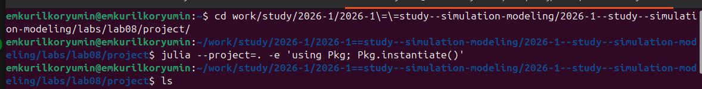
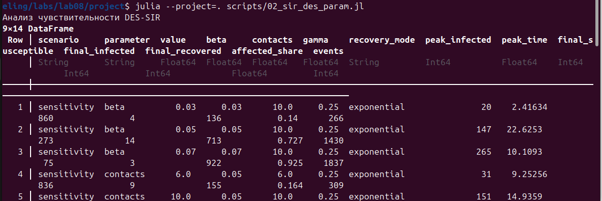
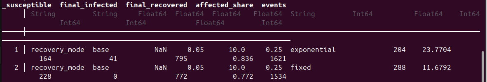
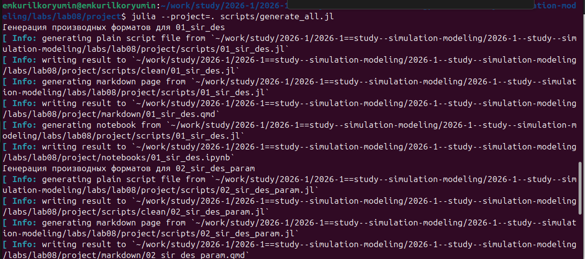
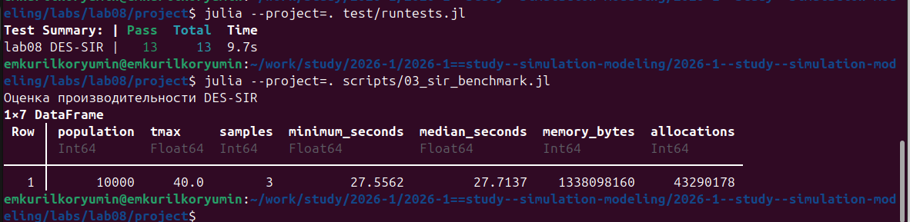

---
## Author
author:
  name: Курилко-Рюмин Евгений Михайлович
  degrees: student
  orcid: 0000-0002-0877-7063
  email: 1132232883@rudn.ru
  affiliation:
    - name: Российский университет дружбы народов
      country: Российская Федерация
      postal-code: 117198
      city: Москва
      address: ул. Миклухо-Маклая, д. 6
## Title
title: "Лабораторная работа №8"
subtitle: "Реализация модели SIR в дискретно-событийном подходе"
author: "Курилко-Рюмин Евгений Михайлович"
date: today
date-format: "YYYY-MM-DD"
license: CC BY
---
# Информация

## Докладчик

::: {.columns align=center}
::: {.column width="65%"}

- Курилко-Рюмин Евгений Михайлович
- студент
- Российский университет дружбы народов им. П. Лумумбы
- [1132232883@rudn.ru](mailto:1132232883@rudn.ru)
- направление: математическое моделирование

:::
::: {.column width="35%"}

# Цель работы

- Реализовать стохастическую DES-модель распространения инфекции `SIR`
- Подготовить воспроизводимый Julia-проект
- Сравнить DES с системой ОДУ
- Исследовать влияние параметров модели
- Сгенерировать `.jl`, `.ipynb` и `.qmd` из литературного кода

# Модель `SIR`

- `S` — восприимчивые
- `I` — инфицированные
- `R` — выздоровевшие

$$
R_0 = \frac{\beta c}{\gamma}
$$

- `beta` — вероятность заражения при контакте
- `c` — частота контактов
- `gamma` — интенсивность выздоровления

# Дискретно-событийный подход

- Каждый индивид моделируется отдельным процессом `ConcurrentSim`
- Контакты возникают через экспоненциальные интервалы времени
- При контакте с инфицированным заражение происходит с вероятностью `beta`
- Выздоровление происходит через случайное время со средним `1 / gamma`
- Виртуальное время продвигается от события к событию

# Архитектура проекта

- `src/SIRDESLab08.jl` — ядро модели
- `scripts/01_sir_des.jl` — базовый литературный сценарий
- `scripts/02_sir_des_param.jl` — параметрические эксперименты
- `scripts/generate_all.jl` — генерация производных форматов
- `test/runtests.jl` — автоматические проверки

# Подготовка окружения

{width=100%}

- Активировано окружение проекта
- Установлены зафиксированные зависимости `Julia`

# Базовый сценарий

- `u0 = [990, 10, 0]`
- `beta = 0.05`
- `c = 10`
- `gamma = 0.25`
- `tmax = 40`
- `R_0 = 2`

{width=82%}

# Выполнение базового сценария

{width=100%}

- Результат выводится в виде таблицы метрик
- Полная траектория сохраняется в `data/sims`

# Сравнение с системой ОДУ

{width=88%}

- DES сохраняет случайные флуктуации
- Детерминированная модель задаёт гладкую опорную кривую
- Общая эпидемическая динамика согласуется

# Анализ чувствительности

{width=48%}
{width=48%}

- Рост `beta` и `c` ускоряет распространение инфекции
- Эпидемический пик становится выше и наступает раньше

# Терминальный вывод анализа чувствительности

{width=100%}

# Влияние выздоровления

{width=72%}

- Рост `gamma` сокращает среднюю длительность болезни
- Пик числа инфицированных снижается
- Итоговая доля заболевших уменьшается

# Фиксированная длительность болезни

{width=82%}

- В дополнительном режиме время болезни равно `1 / gamma`
- Исчезает длинный хвост экспоненциального распределения
- Выздоровления становятся более синхронными

# Сравнение режимов в терминале

{width=100%}

# Воспроизводимость

- В проекте используется фиксированное зерно `StableRNG`
- Результаты сохраняются в `data/sims/*.csv`
- Из литературных сценариев автоматически формируются:
  - чистые Julia-скрипты
  - `Jupyter notebook`
  - документация `Quarto`
- Notebook выполняются ядром `julia-1.10`

# Генерация literate-материалов

{width=100%}

# Тесты и оценка производительности

{width=100%}

- Автоматические проверки: `13 / 13`
- Benchmark для популяции из `10000` индивидов
- Медианное время выполнения: около `27` секунд

# Основные выводы

- Реализована агентная DES-модель `SIR`
- Система ОДУ подтверждает общую форму стохастической траектории
- Рост `beta` и `c` усиливает эпидемию
- Рост `gamma` ослабляет эпидемию
- Проект оформлен как воспроизводимый вычислительный эксперимент
