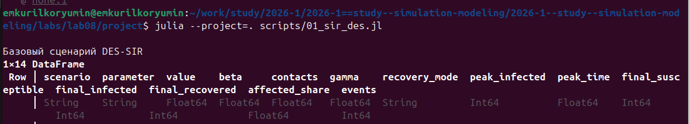
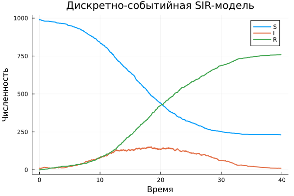
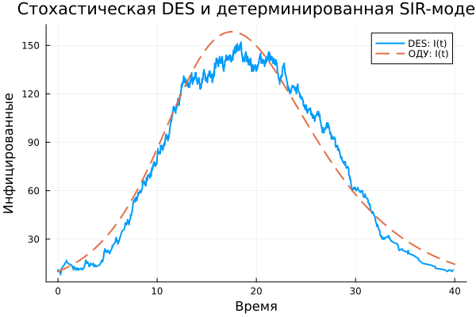
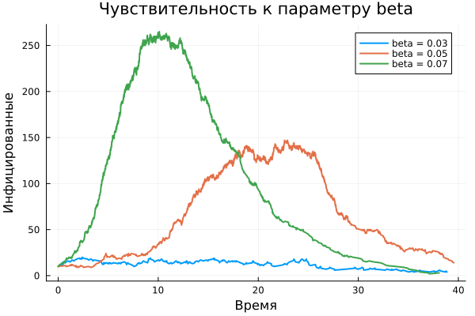
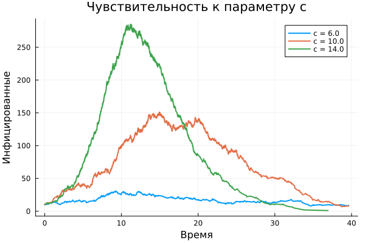
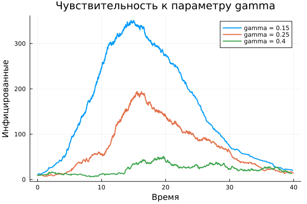
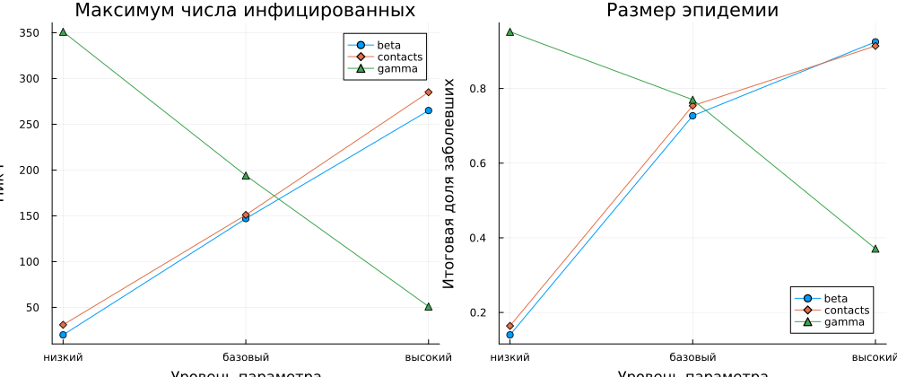
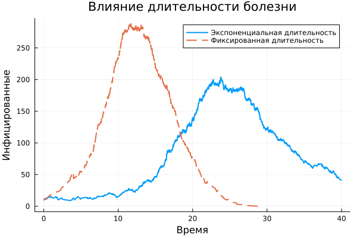

---
## Author
author:
  name: Курилко-Рюмин Евгений Михайлович
  degrees: student
  orcid: 0000-0002-0877-7063
  email: 1132232883@rudn.ru
  affiliation:
    - name: Российский университет дружбы народов
      country: Российская Федерация
      postal-code: 117198
      city: Москва
      address: ул. Миклухо-Маклая, д. 6

## Title
title: "Отчёт по лабораторной работе №8"
subtitle: "Реализация модели SIR в дискретно-событийном подходе"
license: "CC BY"
---

# Цель работы

Целью работы является изучение дискретно-событийного подхода к
имитационному моделированию на примере классической модели распространения
инфекции `SIR`, реализация стохастической агентной модели на языке `Julia`,
проведение параметрических экспериментов и подготовка воспроизводимых
материалов в форматах чистого кода, `Jupyter notebook` и `Quarto`
[@banks2010discrete].

# Задание

В ходе лабораторной работы требовалось:

1. Создать рабочий каталог проекта и установить необходимые пакеты.
2. Реализовать модель `SIR` средствами `ConcurrentSim` и
   `ResumableFunctions`.
3. Выполнить базовый прогон модели и сохранить таблицу результатов.
4. Преобразовать код в литературный стиль.
5. Сгенерировать из литературного кода чистые скрипты, `Jupyter notebook`
   и документацию `Quarto`.
6. Выполнить сгенерированные notebook.
7. Добавить вычисления для набора параметров `beta`, `c`, `gamma`.
8. Сравнить стохастическую модель с детерминированной системой `SIR`.
9. Сравнить экспоненциальную и фиксированную длительности болезни.
10. Интегрировать сгенерированную документацию в итоговый отчёт.

# Теоретическое введение

## Модель `SIR`

Классическая модель `SIR` делит популяцию на три группы
[@kermack1927contribution]:

- `S` — восприимчивые к инфекции;
- `I` — инфицированные;
- `R` — выздоровевшие и получившие иммунитет.

В детерминированном приближении динамика описывается системой

$$
\frac{dS}{dt} = -\beta c \frac{SI}{N},
$$

$$
\frac{dI}{dt} = \beta c \frac{SI}{N} - \gamma I,
$$

$$
\frac{dR}{dt} = \gamma I,
$$

где `beta` — вероятность заражения при одном контакте, `c` — среднее число
контактов за единицу времени, `gamma` — интенсивность выздоровления, а
`N = S + I + R` — размер популяции.

Для начальной стадии эпидемии базовое репродуктивное число приближённо
равно

$$
R_0 = \frac{\beta c}{\gamma}.
$$

В базовом сценарии `R_0 = 2`, поэтому ожидается рост числа инфицированных
до достижения эпидемического пика.

## Дискретно-событийный подход

В дискретно-событийной реализации каждый индивид является отдельным
агентом. Для восприимчивого агента интервалы между контактами имеют
экспоненциальное распределение со средним `1 / c`. После контакта со
случайно выбранным инфицированным агентом заражение происходит с
вероятностью `beta`. Для заболевшего агента время до выздоровления также
распределено экспоненциально со средним `1 / gamma`.

В отличие от системы ОДУ, такая модель сохраняет случайные флуктуации и
может воспроизводить различные траектории эпидемии при одних и тех же
параметрах.

# Выполнение лабораторной работы

## Архитектура проекта

Работа выполнена в каталоге `labs/lab08/project`. Основные файлы проекта
приведены в [табл. @tbl-lab08-files].

| Файл | Назначение |
|---|---|
| `src/SIRDESLab08.jl` | модуль дискретно-событийной модели |
| `scripts/01_sir_des.jl` | литературный код базового сценария |
| `scripts/02_sir_des_param.jl` | литературный код параметрических экспериментов |
| `scripts/03_sir_benchmark.jl` | измерение производительности для `N = 10000` |
| `scripts/generate_all.jl` | генерация `.jl`, `.ipynb`, `.qmd` |
| `test/runtests.jl` | автоматические проверки модели |

: Основные файлы проекта {#tbl-lab08-files}

Для реализации использовались пакеты `ConcurrentSim`,
`ResumableFunctions`, `Distributions`, `StableRNGs`, `DataFrames`, `CSV`,
`Plots`, `DrWatson`, `Literate` и `IJulia`.

Перед выполнением сценариев было активировано окружение проекта и
установлены зафиксированные зависимости. Терминальный вывод этого этапа
показан на [рис. @fig-lab08-env-screen].

{#fig-lab08-env-screen width=100%}

## Реализация дискретно-событийной модели

В модуле `SIRDESLab08.jl` определены структуры `SIRPerson` и `SIRModel`.
Первая хранит идентификатор и состояние агента, вторая — объект симуляции,
параметры, генератор случайных чисел, список агентов и временные ряды
`S(t)`, `I(t)`, `R(t)`.

Жизненный цикл агента реализован как возобновляемая функция `live`.
Оператор `@yield timeout(...)` приостанавливает конкретного агента до
наступления следующего события, не блокируя выполнение остальных
процессов. Функция `activate!` регистрирует процессы агентов, а `sir_run!`
запускает продвижение виртуального времени.

Дополнительно реализованы:

- проверка входных параметров;
- воспроизводимые запуски через `StableRNG`;
- расчёт пика `I`, времени пика и итоговой доли заболевших;
- численное решение детерминированной системы `SIR` методом Рунге-Кутты;
- режим фиксированной длительности болезни `1 / gamma`.

## Базовый вычислительный эксперимент

В базовом сценарии использовались:

- начальное состояние `u0 = [990, 10, 0]`;
- вероятность заражения `beta = 0.05`;
- частота контактов `c = 10`;
- интенсивность выздоровления `gamma = 0.25`;
- длительность моделирования `tmax = 40`.

Результат сохранён в
`data/sims/sir_990_10_0.05_10.0_0.25.csv`. На
[рис. @fig-lab08-base] показана стохастическая траектория численности
трёх групп.

{#fig-lab08-base-screen width=100%}

{#fig-lab08-base width=92%}

График имеет характерный для эпидемии вид: после начального роста числа
инфицированных формируется пик, затем количество активных случаев
снижается из-за уменьшения числа восприимчивых и накопления выздоровевших.

## Сравнение с детерминированной моделью

Для тех же начальных данных построено решение системы ОДУ. На
[рис. @fig-lab08-ode] видно, что стохастическая DES-модель колеблется
вокруг гладкой детерминированной кривой, но сохраняет ту же общую динамику.

{#fig-lab08-ode width=92%}

## Параметрические эксперименты

В литературный код добавлены серии запусков:

- `beta ∈ {0.03, 0.05, 0.07}`;
- `c ∈ {6, 10, 14}`;
- `gamma ∈ {0.15, 0.25, 0.40}`.

Для каждого сценария рассчитаны пик `I`, время пика и итоговая доля
заболевших. Итоговая таблица сохранена в
`data/sims/sir_sensitivity_summary.csv`.

{#fig-lab08-sensitivity-screen width=100%}

{#fig-lab08-beta width=92%}

{#fig-lab08-contacts width=92%}

{#fig-lab08-gamma width=92%}

Полученные траектории соответствуют смыслу параметров модели. Увеличение
`beta` и `c` ускоряет распространение инфекции и повышает эпидемический
пик. Увеличение `gamma` сокращает среднюю длительность болезни, поэтому
снижает пик числа инфицированных и итоговый размер эпидемии.

{#fig-lab08-metrics width=92%}

## Фиксированная длительность болезни

В дополнительном эксперименте экспоненциальное время до выздоровления
заменено фиксированной величиной `1 / gamma`. На
[рис. @fig-lab08-recovery] сопоставлены две траектории.

{#fig-lab08-recovery-screen width=100%}

{#fig-lab08-recovery width=92%}

Фиксированная длительность болезни убирает длинный хвост распределения
времени выздоровления и делает изменения числа активных случаев более
синхронными. При этом общая эпидемическая динамика сохраняется.

## Literate-представление и документация

Файл `scripts/generate_all.jl` автоматически формирует производные
материалы из двух литературных сценариев:

- чистые скрипты в `scripts/clean`;
- документацию `Quarto` в `markdown`;
- notebook в `notebooks`.

После генерации notebook были выполнены с помощью ядра `julia-1.10`.
Выполненные версии сохранены с суффиксом `.executed.ipynb`. Ниже
сгенерированная документация `Quarto` интегрирована в отчёт как приложения.

{#fig-lab08-literate-screen width=100%}

## Оценка производительности

Для популяции из `10000` индивидов добавлен отдельный сценарий
`scripts/03_sir_benchmark.jl`. После прогрева он выполняет три измерения
через `BenchmarkTools` и сохраняет минимальное и медианное время, объём
выделенной памяти и число аллокаций в
`data/sims/sir_benchmark_10000.csv`.

По результатам измерений минимальное время выполнения составило
`25.63` с, медианное — `26.63` с. Медианный объём выделенной памяти равен
примерно `1.34` ГБ при `43.3` млн аллокаций.

{#fig-lab08-tests-benchmark-screen width=100%}

Возможные направления оптимизации: сокращение числа объектов событий,
предварительное выделение памяти под статистику, пакетная генерация
случайных чисел и переход к агрегированной модели при больших популяциях.

# Выводы

В ходе лабораторной работы реализована стохастическая
дискретно-событийная модель `SIR` на языке `Julia`. Каждый индивид
представлен отдельным агентом, а контакты, заражения и выздоровления
обрабатываются как события виртуального времени.

Базовый эксперимент показал ожидаемую эпидемическую динамику. Сравнение с
системой ОДУ подтвердило согласованность общей формы траекторий.
Параметрические эксперименты показали, что увеличение вероятности
заражения и частоты контактов усиливает эпидемию, а увеличение интенсивности
выздоровления ослабляет её.

Из литературного кода автоматически сформированы чистые скрипты,
`Jupyter notebook` и документация `Quarto`. Таким образом, вычислительный
эксперимент оформлен как воспроизводимый проект.

# Приложение A. Базовый литературный сценарий {.unnumbered}



# Приложение B. Параметрические эксперименты {.unnumbered}



# Список литературы{.unnumbered}

::: {#refs}
:::
